<p align="center">
  
</p>

<h1 align="center">Lingxi AI Agent</h1>

<p align="center">
  <strong>Run a full AI Agent legion on your desktop</strong><br/>
  14+ models · Local-first · Persona distillation · Self-evolution · Screen control · Agent mesh
</p>

<p align="center">
  <a href="LICENSE"></a>
  
  
  
  
  
</p>

<p align="center">
  <a href="README.md">中文</a> ·
  <a href="#-capability-map">Capabilities</a> ·
  <a href="#-why-lingxi">Why Lingxi</a> ·
  <a href="#-core-highlights">Highlights</a> ·
  <a href="#-feature-deep-dive">Features</a> ·
  <a href="#-quick-start">Quick start</a> ·
  <a href="#-architecture">Architecture</a> ·
  <a href="#-support">Support</a>
</p>

<br/>

---

## 📷 Overview

<!-- 📷 Hero screenshot -->
<p align="center">
  
</p>
<p align="center"><sub>The Lingxi workbench — chat, agents, and tools in one place</sub></p>

<br/>

---

## 🗺️ Capability map

> The diagram below shows Lingxi's full capability landscape. From the desktop shell to the AI runtime, every module works in concert to form a complete Agent operating system.

<!-- 📷 Capability panorama diagram -->
<p align="center">
  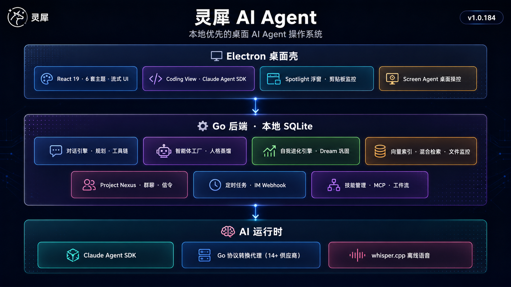
</p>
<p align="center"><sub>Lingxi AI Agent system capability panorama — from the desktop shell to the AI runtime</sub></p>

<br/>

### Capability checklist

| Layer | Module | Highlights |
|:----:|--------|----------|
| **🖥️ Desktop** | Electron 36 | Window mgmt · Splash · safeStorage · global shortcuts · screenshot · Spotlight float · clipboard watcher |
| **💬 Chat engine** | Streaming chat | Three-layer split (thinking / tools / body) · Mermaid/PlantUML · slash commands · two-phase planning · interactive wizard · voice input |
| **🤖 Agents** | Agent factory | 17 templates · 5-step wizard · persona distillation · group-chat personality · external settings · temperature/max_tokens |
| **🧬 Evolution** | Self-evolution engine | Correction / thumbs down / rich threads → long-term memory · global scan · Dream memory consolidation · per-entry revert |
| **📚 Knowledge** | Deep RAG | Vector index · BM25 · RRF hybrid retrieval · folder watch · auto incremental re-index · `[N]` citations · web collection |
| **🌐 Mesh** | Project Nexus | mDNS LAN · WAN signaling · bidirectional streaming · human takeover · group chat (WeChat-style + personality behavior engine) |
| **🖥️ Screen** | Screen Agent | Screen capture understanding · action planning · OTA loop · safety blocklist · action audit |
| **🧭 Proactive** | Proactive Agent | Daily report · unfinished-task tracking · scheduled triggers · context-aware suggestions |
| **🔍 Search** | Deep web search | DuckDuckGo · Wikipedia multi-source · LLM synthesis · citation tracking · SSE real-time progress |
| **📊 Context** | Token water level | Real-time token counting · water-level visualization · auto summarize-compress · session card preview |
| **🔧 Platform** | Tool ecosystem | Skills · MCP · visual workflows · scheduled tasks · IM connectors (Feishu streaming) |
| **🧠 AI runtime** | Multi-model bridge | 14+ providers · pure-Go protocol translation · Claude Agent SDK · whisper.cpp offline ASR |
| **📱 Remote** | H5 + Flutter | LAN direct · public cloud tunnel · Flutter mobile · 3-section home · personalization |
| **🔒 Security** | Local-first | On-device SQLite · offline-capable · SSO login · pair auth · encrypted keys · rate limiter · graceful shutdown |

<br/>

---

## 🤔 Why Lingxi

> **Lingxi is not "another chat window" — it's an AI Agent operating system on your desktop.**

| Pain point | Lingxi's solution |
|------|-----------|
| Data all lives in the cloud, zero privacy | **Local-first**: sessions, knowledge bases, API keys, evolution logs all stored in on-device SQLite; works offline |
| "Custom assistant" is just a system prompt swap | **Real Agent**: independent skill packs + RAG knowledge + MCP tools + workflow orchestration |
| Correct the AI a hundred times, same mistake next time | **Self-evolution engine**: corrections / thumbs down / rich threads auto-refined into long-term memory and knowledge |
| Agents can't collaborate | **Project Nexus**: cross-device agent auto-discovery, bidirectional streaming chat, group collaboration |
| Long sessions blow up the context window | **Token water level + auto-summarize**: real-time token tracking, auto-compress summaries near threshold |
| Web search results are scattered | **Deep web search**: multi-source parallel (DuckDuckGo + Wikipedia) + LLM synthesis + citation tracking |
| Mobile experience is poor | **Flutter 3-section home + 8 advanced interactions**: Hero transition · skeleton screen · scroll parallax · haptics |
| Multi-agent group chat is a mechanical round-robin | **Personality behavior engine**: probability-driven, interest-matched, natural delays — chats like a real person |

<br/>

---

## ✨ Core highlights

<table>
<tr>
<td width="160" align="center"><strong>🔒 Local-first</strong></td>
<td>Data never leaves your computer. SQLite storage, local vector index, offline ASR via built-in whisper.cpp — works offline with local models.</td>
</tr>
<tr>
<td align="center"><strong>🤖 14+ providers</strong></td>
<td>Anthropic · OpenAI · DeepSeek · Qwen · Gemini · Doubao · GLM · Kimi · MiniMax · Groq · Ollama · LM Studio… Built-in pure-Go protocol translation lets one UI reach every model.</td>
</tr>
<tr>
<td align="center"><strong>🧭 Proactive Agent</strong></td>
<td>Not just passive Q&A. Daily report generation · unfinished-task tracking · scheduled triggers · context-aware suggestions. The agent comes to you at the right time, not the other way around.</td>
</tr>
<tr>
<td align="center"><strong>🧠 Real agents</strong></td>
<td>Each agent binds its own skill pack + RAG knowledge base + MCP tools + workflows; supports two-phase planning, interactive Q&A, autonomous tool-chain invocation.</td>
</tr>
<tr>
<td align="center"><strong>👤 Persona distillation</strong></td>
<td>Powered by <a href="https://github.com/titanwings/colleague-skill">dot-skill</a>: upload WeChat logs, PDFs, emails — distill a colleague's, friend's, or celebrity's communication style and personality into an agent. Parallel multi-person runs supported.</td>
</tr>
<tr>
<td align="center"><strong>🧬 Self-evolution</strong></td>
<td>Corrections / thumbs-down / rich threads are auto-refined into long-term memory → agents get smarter with use. Global scan + per-session triggers; per-entry revert; Dream memory consolidation auto-organizes and refines.</td>
</tr>
<tr>
<td align="center"><strong>🌐 Agent mesh</strong></td>
<td>Project Nexus: LAN mDNS + WAN signaling for cross-device auto-discovery, 1-on-1 streaming dialogue, humans can step in at any time.</td>
</tr>
<tr>
<td align="center"><strong>👥 WeChat-style group chat</strong></td>
<td>Multiple agents in one room · personality-driven speak probability · @mentions & quotes · chats like a real person, not a script reading aloud.</td>
</tr>
<tr>
<td align="center"><strong>🖥️ Screen control</strong></td>
<td>Screen Agent watches the screen → plans actions → executes mouse/keyboard; every step confirmed, dangerous ops forcibly blocked.</td>
</tr>
<tr>
<td align="center"><strong>📦 Out of the box</strong></td>
<td>macOS <code>.dmg</code> / Windows installer. Bundles Go backend + Node + whisper.cpp + Claude CLI — no Docker, download and run.</td>
</tr>
</table>

<br/>

---

## 🎯 Feature deep dive

> Every section includes screenshots. Already-captured images are shown inline; placeholders will display once you drop the corresponding PNG into `images/screenshots/`.

---

### 💬 Smart conversation — more than just chat

Streaming output is split into **thinking**, **tool calls**, and **body text** — each with dedicated fold/expand interactions. OpenAI reasoning token passthrough shows the full chain of thought. Code blocks get syntax highlighting with one-click copy. Messages can be edited and resent (context is automatically truncated). `⌘K` searches all message history.

**Rich Markdown rendering** is a standout: Mermaid diagrams (flowcharts, sequence, architecture, Gantt…) and PlantUML render as interactive SVGs right inside the chat — agents actively draw diagrams to explain ideas.

Also built in: `/` slash commands (12 built-in), two-phase planning, interactive wizard flows, image paste, file drag-and-drop, voice input (local whisper.cpp), TTS readout, message pinning, quick-reply suggestions, RAG `[N]` citation annotations with hover detail cards, batch ZIP session export, and more.

<!-- 📷 Streaming chat -->
<p align="center">
  
</p>
<p align="center"><sub>Streaming chat · thinking fold · code highlighting · tool calls</sub></p>

<br/>

<table>
<tr>
<td width="50%">

**Core chat capabilities**
- Streaming · thinking/tools/text separation
- Code blocks with syntax highlighting + copy
- Edit & resend · message pinning
- Feedback (thumbs up/down)
- `⌘K` search · export Markdown · batch export session ZIP
- Virtual scroll (100+ messages, zero lag)

</td>
<td width="50%">

**Enhanced experience**
- `/` slash commands · two-phase planning
- Interactive wizards · info-collection blocks
- Image paste (`⌘V`) · file drag-and-drop
- Voice input (local whisper.cpp)
- TTS readout · quick-reply suggestions
- RAG `[N]` citations · hover detail cards

</td>
</tr>
</table>

<!-- 📷 Agent interaction -->
<p align="center">
  
</p>
<p align="center"><sub>Autonomous agent execution · tool calls · multi-turn reasoning</sub></p>

<!-- 📷 Planning mode -->
<p align="center">
  
</p>
<p align="center"><sub>Two-phase planning — choose dimensions first, then execute</sub></p>

<!-- 📷 Mermaid chart -->
<p align="center">
  
</p>
<p align="center"><sub>Mermaid / PlantUML rendered as interactive SVG in chat</sub></p>

<br/>

| Shortcut | Action | Shortcut | Action |
|----------|--------|----------|--------|
| `⌘ K` | Search messages | `⌘ N` | New chat |
| `⌘ B` | Toggle sidebar | `⌘ ,` | Settings |
| `⌘ /` | Shortcuts panel | `⌘ ⇧ S` | Screenshot to input |
| `⌘ ⇧ Space` | Spotlight | `⌘ ⇧ Esc` | Abort Screen Agent |
| `/` | Slash commands | `Enter` / `⇧Enter` | Send / newline |

---

### 🏭 Agent factory — your agent assembly line

Each agent is not a simple label but a **fully configurable entity**. A five-step creation wizard lets you fine-tune:

- **Identity**: name, avatar (emoji or custom image upload), description
- **Role**: system prompt, temperature, max_tokens, plus **group-chat personality** knobs (speak probability, interest tags, quiet hours, style hints…)
- **Capabilities**: bind skill packs, RAG knowledge bases, MCP tool servers
- **External settings**: Nexus visibility toggle, capability tags, authorization level, restricted info
- **Preview**: review everything before creation

**17 built-in templates** cover business, engineering, creative, and productivity scenarios — create from a template and customize.

<!-- 📷 Agent factory -->
<p align="center">
  
</p>
<p align="center"><sub>Agent factory — template market + custom creation</sub></p>

<!-- 📷 Role settings -->
<p align="center">
  
</p>
<p align="center"><sub>Five-step wizard · role settings · group-chat personality</sub></p>

<!-- 📷 Capability bindings -->
<p align="center">
  
</p>
<p align="center"><sub>Capability bindings — skills · knowledge base · MCP tools</sub></p>

<details>
<summary><b>17 built-in templates</b></summary>

| Category | Templates |
|----------|-----------|
| Business | Sales · Analyst · HR · Legal |
| Engineering | Code Review · Architect · DevOps · Security · DBA |
| Creative | Writer · Copy · Translation · Academic |
| Productivity | PM · Fitness · Finance · Travel |

</details>

---

### 👤 Persona distillation — give AI a real personality

One of Lingxi's most distinctive features. Powered by [dot-skill](https://github.com/titanwings/colleague-skill), you can extract a person's communication style, personality traits, and behavior patterns from **real chat materials** and inject them into an agent.

**Supported materials**: WeChat/QQ chat exports (.md/.txt), PDFs, email archives, etc.

**Three distillation modes**:
- `colleague` — work relationships: extract professional abilities, communication style, work habits
- `close` — intimate relationships: extract personality traits, emotional expressions, interaction patterns
- `celebrity` — public figures: extract public speaking style, opinion tendencies

**Key features**:
- **Parallel multi-person distillation** (up to 5 concurrent), SSE real-time streaming logs
- **Independent distill records**: each run stored separately, never pollutes the default skill library
- **Import from records**: when creating a new agent, pick an existing distill record and one-click fill persona config

<!-- 📷 Distillation modal (screenshot needed: show family picker + material list + streaming log area) -->
<p align="center">
  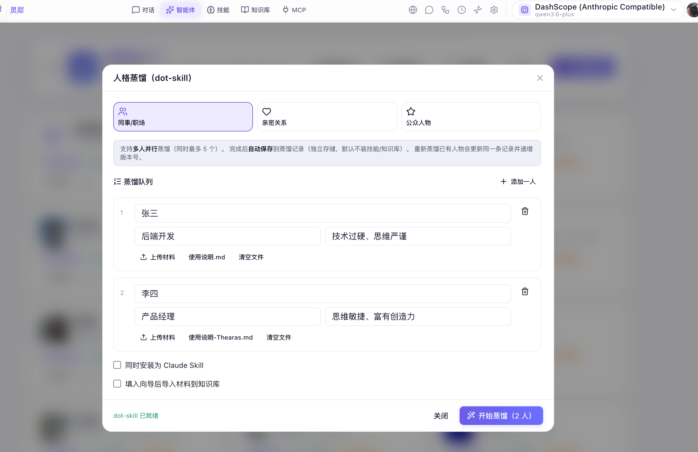
</p>
<p align="center"><sub>Persona distillation — parallel runs · SSE streaming logs · material management</sub></p>

<!-- 📷 Distill records (screenshot needed: records panel with multiple entries + status) -->
<p align="center">
  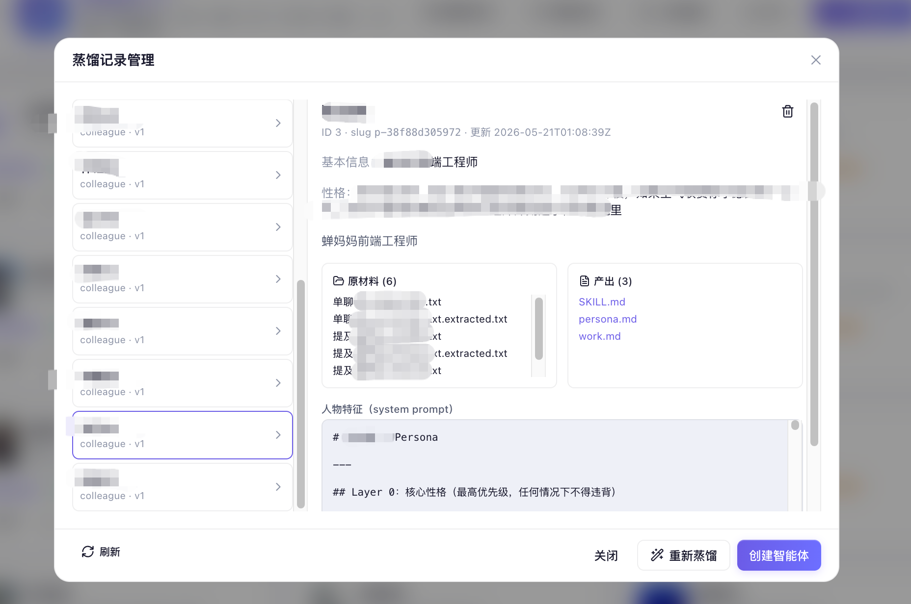
</p>
<p align="center"><sub>Distill records — isolated storage · one-click import into new agents</sub></p>

---

### 🧬 Self-evolution — agents that learn from use

Traditional AI assistants never change: you correct them a hundred times, and next session they repeat the same mistake. Lingxi's self-evolution engine changes that.

**Trigger methods**:

| Trigger | What happens |
|---------|-------------|
| User correction / thumbs down | Analyze conversation → write to long-term memory / knowledge doc / fix skill description |
| Session end (≥6 messages + cooldown) | Automatic session-level evolution |
| Global scan (default every 6 hours) | Quiet-hours-aware batch inspection of all evolution-enabled agents |
| Manual trigger | "Extract knowledge" button on message bubbles |

**Key guarantee**: evolution is not a black box. Every evolution log can be **viewed in detail**, **filtered by type**, **searched by keyword**, and unsatisfactory results can be **reverted individually** (memory/knowledge/skill changes auto-rolled back).

<!-- 📷 Self-evolution -->
<p align="center">
  
</p>
<p align="center"><sub>Evolution timeline — filterable · searchable · per-entry revert</sub></p>

<table>
<tr>
<td width="50%">

<p align="center">
  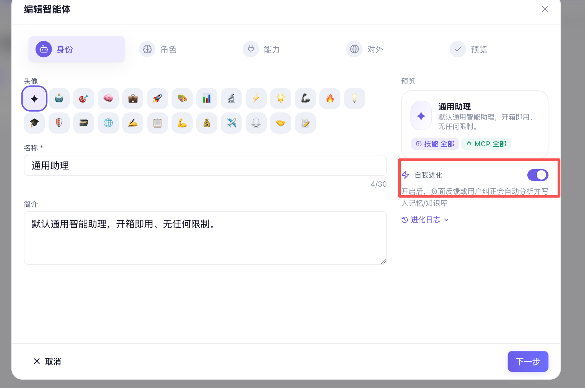
</p>
<p align="center"><sub>Per-agent evolution toggle</sub></p>

</td>
<td width="50%">

<p align="center">
  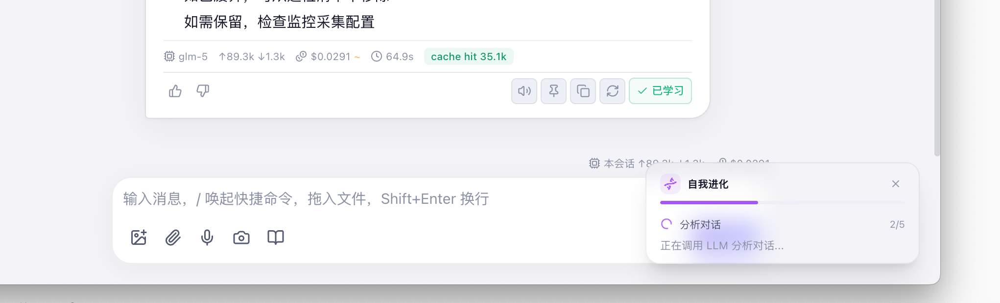
</p>
<p align="center"><sub>"Extract knowledge" button on bubbles</sub></p>

</td>
</tr>
</table>

---

### 📚 Deep RAG — local knowledge, smart retrieval

Lingxi ships a complete local RAG (Retrieval-Augmented Generation) pipeline — no cloud vector database needed.

**Technical details**:
- **Vector engine**: pure Go cosine similarity, 768-dim embeddings, separate `vectors.db`
- **Chunking**: recursive splitting (512 chars/chunk, 128 overlap), paragraph → sentence → character boundaries
- **Hybrid retrieval**: vector KNN + keyword BM25 + RRF fusion ranking
- **Auto-indexing**: upload triggers async chunk + embed + store; folder watch (fsnotify) detects changes for incremental re-indexing
- **Chat integration**: when an agent has a bound knowledge base, conversations automatically run semantic search and inject the most relevant document fragments as context, with `[1]` `[2]` superscript citations. Hover to see citation detail cards.
- **Web collection**: paste a URL → go-readability extracts the article body → auto-ingested and indexed (joins the same RAG pipeline)

**Supported formats**: `.md` `.txt` `.csv` `.tsv` `.json` `.pdf` `.docx` + any web URL

<!-- 📷 Knowledge base -->
<p align="center">
  
</p>
<p align="center"><sub>Knowledge base — categories · semantic search · index status · folder watch · web collection</sub></p>

---

### 🧭 Proactive Agent — the agent comes to you

No longer a passive assistant waiting for instructions. Each agent can be configured with proactive behavior:

- **Daily report generation**: scheduled summary of the day's session highlights, pushed to you proactively
- **Unfinished-task tracking**: remembers pending work across sessions and nudges you
- **Scheduled triggers**: periodic auto-execution, no manual trigger needed
- **Context-aware**: adjusts suggestions based on the current active window / browser

The agent finds you at the right time in the right way, not the other way around.

<!-- 📷 Proactive Agent -->
<p align="center">
  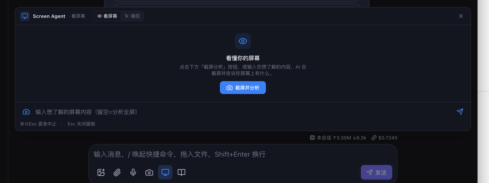
</p>
<p align="center"><sub>Proactive Agent — daily report · task tracking · scheduled triggers · context-aware</sub></p>

---

### 🔍 Deep web search — beyond keywords

Trigger a multi-source web search with one `/search` slash command:

- **Multi-source parallel**: DuckDuckGo + Wikipedia + other extensible sources
- **LLM synthesis**: auto-merge, dedupe, distill key points, generate summary
- **Citation tracking**: every conclusion annotated with source URL, click to verify
- **SSE real-time progress**: search → fetch → synthesize → output, full pipeline visible
- **Dedicated page**: DeepSearchPage with timeline, source cards, citation chips

<!-- 📷 Deep search -->
<p align="center">
  
</p>
<p align="center"><sub>Deep search — multi-source parallel · LLM synthesis · citation tracking · real-time progress</sub></p>

---

### 📊 Token water level — long sessions don't blow the stack

Real-time monitoring of each session's token usage, auto-compress near the threshold:

- **Real-time counting**: precise tracking of input / output / cache / reasoning tokens
- **Water-level visualization**: session card shows a token progress bar
- **Auto summarize-compress**: auto-summarize history when threshold exceeded
- **Session card preview**: hover to see session summary
- **Manual trigger**: `/api/sessions/:id/summarize` one-click compression

<!-- 📷 Token water level -->
<p align="center">
  
</p>
<p align="center"><sub>Token water level — real-time monitoring · auto-compress · session card preview</sub></p>

---

### 🖥️ Screen Agent — see the screen, take action

Screen Agent gives Lingxi the ability to **see and operate your desktop**. Instead of just answering questions, it acts like a remote-assistance colleague who directly performs actions for you.

**Workflow (OTA loop)**:
1. **Observe** — capture current screen, understand content via multimodal model
2. **Think** — plan action steps based on your instruction (with risk assessment)
3. **Act** — execute step by step: mouse clicks, keyboard input, scrolling, opening apps

**Robust safety**:
- Per-step user confirmation (optional auto mode)
- Dangerous-action blocklist forces confirmation even in auto mode
- Rate limit: minimum 500ms/step, 60 actions/minute cap
- Emergency stop: `⌘⇧Esc` global shortcut
- Audit trail: all actions logged to `screen_actions` table

<!-- 📷 Screen Agent (screenshot needed: show capture block / step plan / confirm panel) -->
<p align="center">
  
</p>
<p align="center"><sub>Screen Agent — screen capture · action planning · step-by-step confirmation</sub></p>

---

### 🔦 Spotlight — your proactive assistant

Press `⌘⇧Space` and a lightweight floating panel slides down from the top, without interrupting whatever you're doing.

- **Context-aware**: automatically reads active window name and browser URL
- **Quick Actions**: dynamic shortcuts based on context (in IDE → explain code / generate tests; in browser → summarize / translate)
- **Quick chat**: carries context metadata + knowledge base search for precise one-shot answers
- **Smart clipboard**: 2-second polling, auto-classifies (code / error / URL / long English text / command), non-intrusive suggestion chip in the bottom-right corner

<!-- 📷 Spotlight (screenshot needed: ⌘⇧Space floating panel with Quick Actions) -->
<p align="center">
  
</p>
<p align="center"><sub>Spotlight — ⌘⇧Space global float · context-aware · Quick Actions</sub></p>

---

### 🌐 Project Nexus — cross-device agent mesh

Project Nexus lets agents on different computers **auto-discover each other and converse autonomously**.

```
  Instance A (your PC)                  Instance B (peer PC)
  ┌─────────────────┐                  ┌─────────────────┐
  │ 🤖 Reviewer     │ ◄── stream ──► │ 🤖 Architect     │
  │ 🧑 You (observe)│    mDNS / WAN  │ 🧑 Peer (observe)│
  └─────────────────┘                  └─────────────────┘
```

**Discovery**: LAN via mDNS (`_lingxi._tcp`, 10s scan); WAN via public signaling server (works out of the box).

**Conversation flow**:
1. See a peer in the discovery panel → click "Start conversation" → pick topic & agent
2. Peer receives invite → picks their agent → accept/reject
3. Both agents start autonomous dialogue: first-person natural speech, can use skills and knowledge
4. Bidirectional token-level streaming — both sides see the other agent thinking and writing in real time

**Humans stay in control**: pause, take over (switch to manual typing), terminate, or intervene during summary approval — at any time.

<!-- 📷 Nexus discovery -->
<p align="center">
  
</p>
<p align="center"><sub>Node discovery — LAN + WAN merged list · online status · one-click start</sub></p>

<table>
<tr>
<td width="50%">

<p align="center">
  
</p>
<p align="center"><sub>Bidirectional streaming A2A</sub></p>

</td>
<td width="50%">

<p align="center">
  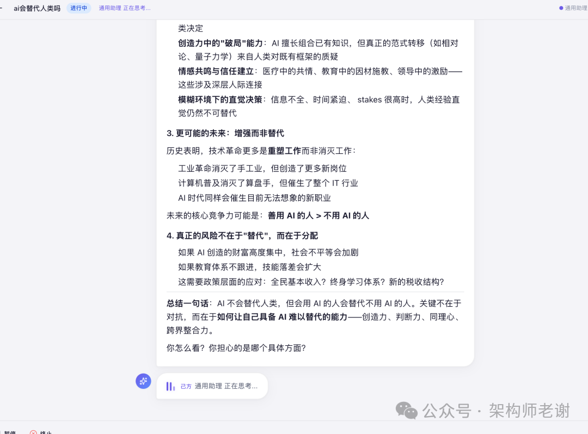
</p>
<p align="center"><sub>Cross-instance real-time collaboration</sub></p>

</td>
</tr>
</table>

<!-- 📷 Invite -->
<p align="center">
  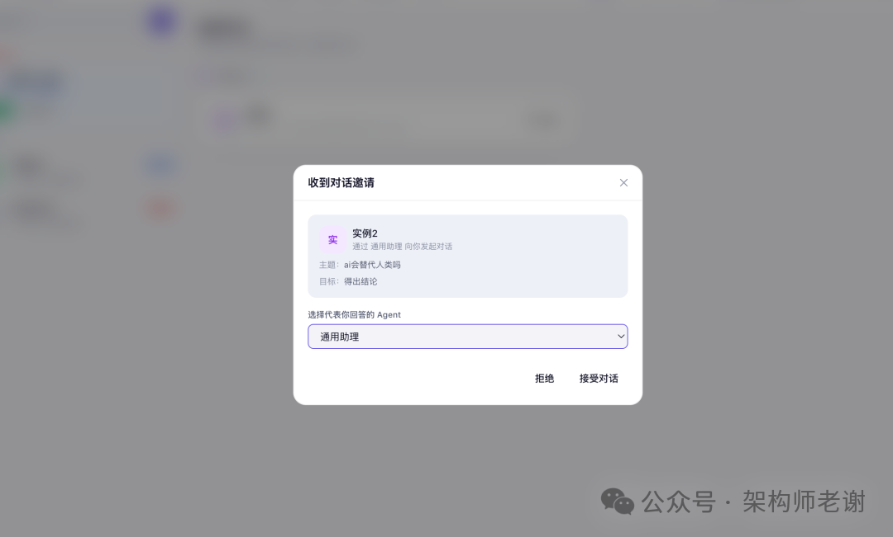
</p>
<p align="center"><sub>Receiving an invite — pick your agent · view topic & goals · accept / reject</sub></p>

---

### 👥 WeChat-style agent group chat

Lingxi's signature feature. Not simple round-robin, but a **pixel-perfect WeChat-like** group chat experience where multiple AI agents converse like real people.

**UI details**:
- Green bubbles (self) / white bubbles (others) · 36px rounded avatars
- Merged bubbles (same sender within 3 minutes)
- Timestamp capsules (shown only when gap ≥ 3 min)
- Quote replies (gray-background block with left bar)
- Recall within 2 minutes · image messages · @mentions
- Top 9-avatar stack bar · member drawer

**Personality behavior engine** (`groupbehavior/`):
- On each new message, all joined local agents **independently and concurrently** evaluate whether to speak
- Dimensions: @me (forced), interest match (+30), cold room (+40), challenged (+50), quiet hours (×0.1), just spoke (×0.2)
- After deciding to speak, wait within personality-set delay range (min~max) + random jitter
- **Quirks** (micro-personality): occasional typos, occasional "+1" echo, occasional emoji suffix
- **Cold-start watcher**: checks every 60s; if silent >5 min, triggers cold_start_eligible agents to warm things up

<!-- 📷 Group chat (screenshot needed: WeChat-style UI with green/white bubbles, multiple agents, timestamps, @mentions) -->
<p align="center">
  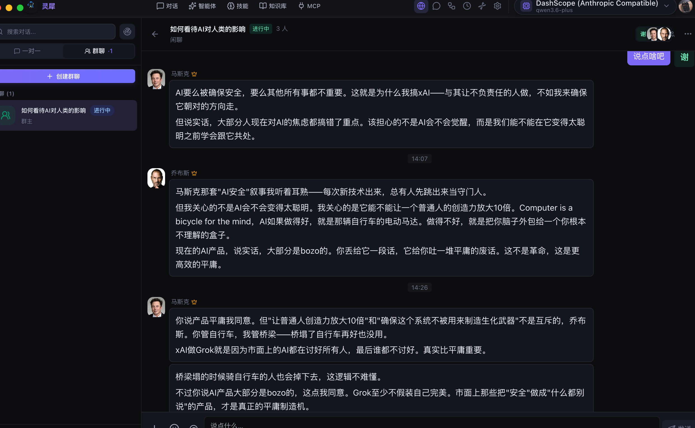
</p>
<p align="center"><sub>WeChat-style agent group chat — personality-driven · natural pacing · @mentions · quotes</sub></p>

---

### 🔧 Skills · MCP · Workflows · Scheduler · IM

Lingxi is a complete agent platform, not just a chat window.

#### Skills management

Agent capabilities extend through "skills." Supports AI-generated skills (streaming), ZIP upload/import, online view/edit, batch upload and export. Integrates with **Smithery.ai marketplace** for one-click community skill installation.

<!-- 📷 Skills -->
<p align="center">
  
</p>
<p align="center"><sub>Skills — AI generation · ZIP import · Smithery marketplace</sub></p>

<!-- 📷 Skill install -->
<p align="center">
  
</p>
<p align="center"><sub>Smithery.ai marketplace — search · categories · one-click install</sub></p>

#### MCP tool management

MCP (Model Context Protocol) lets agents call external tools. Lingxi supports stdio / SSE / HTTP connection methods, import/export config, and one-click enable/disable.

<!-- 📷 MCP -->
<p align="center">
  
</p>
<p align="center"><sub>MCP management — stdio / SSE / HTTP · config export</sub></p>

#### Visual workflows

Drag-and-drop node editor with 6 node types: prompt, conditional branch, loop, delay, code execution, output. Orchestrate complex tasks visually; agents follow the flow automatically.

<!-- 📷 Workflow -->
<p align="center">
  
</p>
<p align="center"><sub>Visual workflow editor — drag nodes · connect · preview execution</sub></p>

#### Scheduled tasks

Let agents run tasks on a schedule: every N minutes/hours/daily/weekly/monthly/custom Cron. Supports stateful mode (agent remembers last run) and stateless mode. Desktop notifications on completion; view run history and jump to the corresponding session.

<!-- 📷 Scheduled tasks -->
<p align="center">
  
</p>
<p align="center"><sub>Scheduler — Cron · run history · desktop notifications · WS live badge</sub></p>

#### IM connectors

Connect agents to WeChat Work, DingTalk, and Feishu via webhooks, making your agents intelligent nodes in enterprise communications. Feishu supports **streaming card push** — CardKit v1 cards with 80ms flush, so agents stream-token responses render live in Feishu.

<!-- 📷 IM connectors -->
<p align="center">
  
</p>
<p align="center"><sub>IM connectors — WeChat Work · DingTalk · Feishu (streaming cards)</sub></p>

---

### ⚙️ Model providers · usage tracking

#### Unified multi-model access

Lingxi's built-in Bridge protocol layer lets you configure API keys and endpoints, then seamlessly use models from 14+ providers. Test connectivity and switch active profiles with one click.

<!-- 📷 Providers -->
<p align="center">
  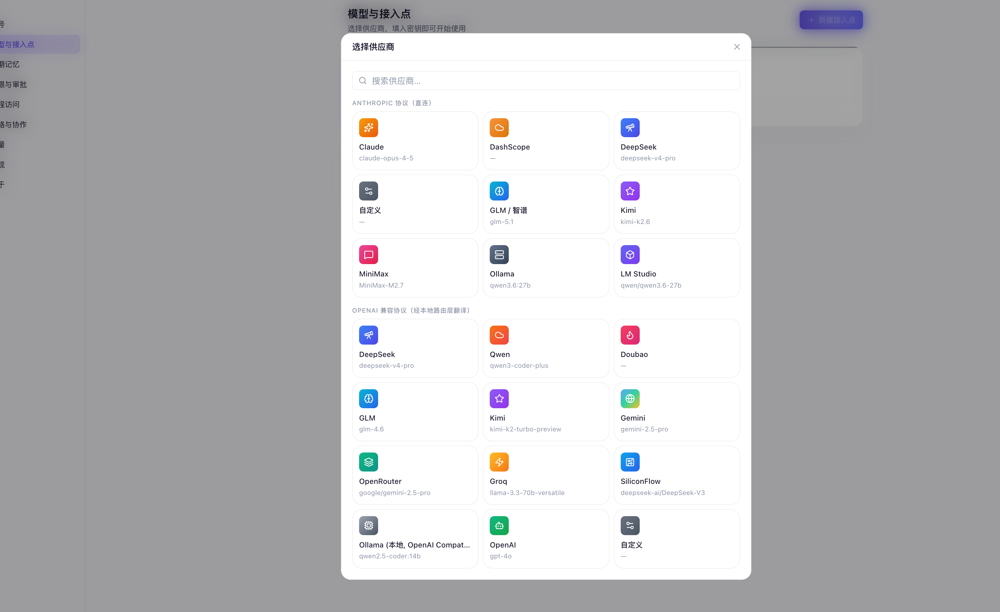
</p>
<p align="center"><sub>API profiles — 14+ providers · connectivity test · one-click switch</sub></p>

<!-- 📷 Provider list -->
<p align="center">
  
</p>
<p align="center"><sub>Supported model providers</sub></p>

#### Usage & budget

Per-conversation token usage and cost tracking with budget alerts. Non-official APIs use a local pricing table for fallback estimates (marked with "~").

<!-- 📷 Usage -->
<p align="center">
  
</p>
<p align="center"><sub>Usage stats — token counts · cost estimates · budget alerts</sub></p>

---

### 🎨 6 themes · polished UI

Lingxi ships with 6 carefully designed themes: **Light · Dark · Midnight · Cyber · Aurora · Cosmos**. All colors are driven by CSS variables — theme switches are instant. The Flutter mobile app independently supports light / dark / follow-system modes.

UI polish includes: bubble corner radii with shadow/hover micro-interactions, ultra-thin custom scrollbars, three-dot wave connection animations, enhanced empty states, and AnimatePresence page transitions.

<!-- 📷 Themes (screenshot needed: appearance settings or 2×3 theme mosaic) -->
<p align="center">
  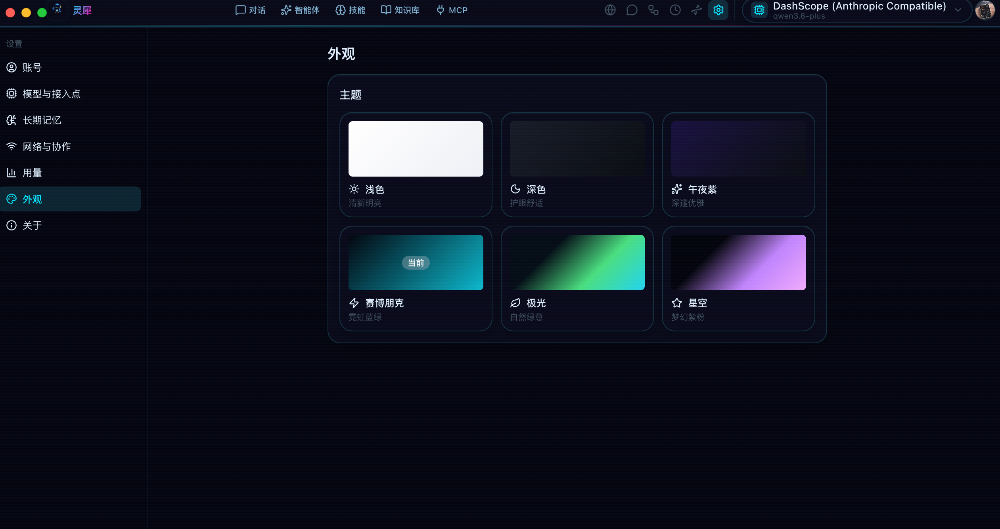
</p>
<p align="center"><sub>6 carefully designed themes · mobile app independent light/dark modes</sub></p>

---

### 🔐 Long-term memory · login · security

- **Long-term memory**: persists across sessions, isolated per agent, auto/manual addition, category management, clear and export
- **Memory consolidation Dream**: LLM auto-merges duplicates, refines vague entries, adds new knowledge, prunes stale ones
- **SSO login**: WeChat / QQ / Google / DingTalk / Douyin OAuth + guest mode
- **Pair authentication**: 6-digit pairing code + encrypted token, bidirectional verification between desktop and mobile
- **Encrypted keys**: safeStorage on-device encryption — keys never leave the device
- **Security hardening**: WebSocket origin check · CORS · rate limiter · graceful shutdown

---

### 🎬 More screenshots

<table>
<tr>
<td width="50%">

<p align="center">
  
</p>
<p align="center"><sub>Agent long task — PPT creation in action</sub></p>

</td>
<td width="50%">

<p align="center">
  
</p>
<p align="center"><sub>Planning mode — intermediate reasoning</sub></p>

</td>
</tr>
<tr>
<td width="50%">

<p align="center">
  
</p>
<p align="center"><sub>Nexus — initiating an agent conversation invite</sub></p>

</td>
<td width="50%">

<p align="center">
  
</p>
<p align="center"><sub>Nexus — receiver picks an agent to respond</sub></p>

</td>
</tr>
</table>

---

## 🏗️ Architecture

```
┌────────────────────────────────────────────────────────────────────┐
│                        Electron 36 desktop shell                   │
│  Window mgmt · Splash · safeStorage · Screenshot · Spotlight · Clipboard│
├───────────────────────────────┬────────────────────────────────────┤
│   React 19 + Vite 8           │    Go 1.24 + Gin + SQLite           │
│   Tailwind CSS · Zustand 5    │    WebSocket · mDNS · signaling relay│
│   Framer Motion 12 · 6 themes│    Vectors · evolution · Dream · groups│
│   Virtual scroll · React.lazy │    Behavior engine · Screen Agent · PTY│
│   Deep search · Token water level│  Proactive Agent · Web knowledge capture│
├───────────────────────────────┤    Claude Agent SDK · sdk-runner     │
│   Flutter mobile · 3-section home│  Pure-Go protocol proxy · Encrypted keys│
│   8 advanced interactions · personalization │ Scheduler · IM connectors · Push │
└───────────────────────────────┴────────────────────────────────────┘
         Bundled: Node.js · whisper.cpp · Claude CLI · Bridge
```

| Layer | Stack |
|-------|-------|
| **Desktop** | Electron 36 · electron-builder |
| **Frontend** | React 19 · Vite 8 · Tailwind 3.4 · Zustand 5 · Framer Motion 12 · Recharts |
| **Backend** | Go 1.24 · Gin 1.10 · ncruces/go-sqlite3 (pure Go, no CGO) · Gorilla WebSocket |
| **AI runtime** | Claude Agent SDK · pure-Go protocol translation proxy · whisper.cpp |
| **Vector engine** | Pure Go cosine · 768-dim embeddings · BM25 + RRF hybrid retrieval |
| **Network** | mDNS · WebSocket signaling · HTTP/WAN Transport |

---

## 📥 Quick start

### macOS (Apple Silicon)

1. Download `.dmg` from [Releases](https://github.com/OdysseyFather/lingxi/releases)
2. Drag to Applications
3. If macOS says it can't be verified: `xattr -cr "/Applications/灵犀.app"`
4. Launch → **Settings → Models & Providers** → configure API key
5. Pick an agent and start chatting; type `/search` to try deep web search

### Windows

Download `灵犀 Setup x.x.x.exe` (installer) or `灵犀 x.x.x.exe` (portable). Configure providers locally.

### Build from source

```bash
# Prerequisites: Node.js >= 20.19 · Go >= 1.24
git clone https://github.com/OdysseyFather/lingxi.git
cd lingxi

# Build all (macOS + Windows)
./build-desktop.sh

# macOS only
./build-desktop.sh mac

# Windows only (cross-compile)
./build-desktop.sh win
```

Build output in `dist-electron/`:

```
dist-electron/
├── mac-arm64/灵犀.app          # Run directly
├── 灵犀-{version}-arm64.dmg    # macOS installer
├── 灵犀 Setup {version}.exe    # Windows installer
└── 灵犀 {version}.exe          # Windows portable
```

<details>
<summary><b>Development mode (three terminals)</b></summary>

```bash
# Terminal 1: Frontend with hot reload
cd frontend-desktop && npm install && npm run dev   # :5173

# Terminal 2: Go backend
cd backend-desktop && go run .                      # :3001

# Terminal 3: Electron shell
cd electron && npm install && npm start
```

</details>

<details>
<summary><b>Troubleshooting</b></summary>

| Issue | Solution |
|-------|----------|
| Vite build fails on Node version | Vite 8 requires Node.js ≥ 20.19; upgrade or download Node 22 |
| npm EACCES permission error | Use temp cache: `NPM_CONFIG_CACHE=/tmp/npm-cache npm install` |
| macOS says app can't be verified | `xattr -cr "/Applications/灵犀.app"` |
| Go build fails | Ensure Go ≥ 1.24; run `go mod tidy` and retry |

</details>

---

## 📱 Mobile app (Flutter)

Lingxi ships a Flutter mobile app (`mobile-flutter/`) as a thin client for the desktop:

- **Pairing**: QR scan or 6-digit pairing code — supports LAN direct connect and WAN tunnel
- **Permanent pairing**: pair once, use forever; pairing token is encrypted
- **3-section home**: 6-grid scenarios · card session list · bottom new-chat pill
- **Full chat**: streaming messages, Markdown rendering, thinking-fold, code highlighting, message regenerate
- **Agent switching**: syncs all agents from desktop, one-click switch
- **Image attachments**: camera/gallery, auto-compress upload, batch multi-file
- **Deep search**: mobile DeepSearchScreen, one-click entry from Discover
- **Global search**: cross-session message search
- **TTS readout**: one-click voice readout per message
- **Personalization**: theme mode (light/dark/follow-system) · font size 0.85x~1.5x · notifications · sounds · haptics · Enter-to-send
- **Visual system upgrade**: 3-level shadows · 6 scene gradients · unified 20px corners · user-bubble brand-color gradient
- **8 advanced interactions**: typewriter · Hero transition · staggered animation · press feedback · skeleton screen · scroll parallax · custom refresh · breathing cursor

> The mobile app depends on a running desktop; all AI compute and data storage stay local on the desktop.

```bash
# Build the mobile app (requires Flutter SDK)
cd mobile-flutter
flutter pub get
flutter run
```

---

## 📜 License

**Personal use and educational license only** — no commercial use. See [LICENSE](LICENSE).

---

## ☕ Support

If Lingxi helps you, consider starring the repo or leaving a tip to support continued development.

<p align="center">
  
  <br/><sub>Scan to tip · support ongoing development</sub>
</p>

---

<p align="center">
  
  <br/><br/>
  <strong>Lingxi</strong> — AI as a work partner, not just a chatbot.
  <br/><br/>
  <sub>Please <a href="https://github.com/OdysseyFather/lingxi">star ⭐</a> if this helps you</sub>
</p>
