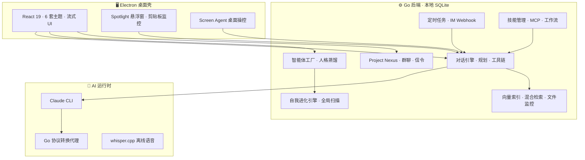

<p align="center">
  
</p>

<h1 align="center">灵犀 AI Agent</h1>

<p align="center">
  <strong>本地优先的桌面 AI Agent 工作台</strong><br/>
  多模型 · 多智能体 · 人格蒸馏 · 深度 RAG · 屏幕操控 · Agent 互联 · 群聊协作 · 自我进化
</p>

<p align="center">
  <a href="LICENSE"></a>
  
  
  
  
</p>

<p align="center">
  <a href="README-EN.md">English</a> ·
  <a href="#-为什么做灵犀">为什么做</a> ·
  <a href="#-核心亮点">核心亮点</a> ·
  <a href="#-能力全景">能力全景</a> ·
  <a href="#-功能详解">功能详解</a> ·
  <a href="#-快速开始">快速开始</a> ·
  <a href="#-技术架构">架构</a> ·
  <a href="#-支持项目">支持</a>
</p>

<br/>

---

## 📷 主界面一览

<!-- 📷 主视觉截图 -->
<p align="center">
  
</p>
<p align="center"><sub>灵犀工作台总览 — 对话、智能体、工具一站式掌控</sub></p>

<br/>

---

## 🤔 为什么做灵犀

市面上 AI 产品很多，ChatGPT、Claude、各种对话 App。但当你真正想把 AI 当作**工作伙伴**而非临时问答机器时，会遇到一连串问题：

- **数据全在云上**：对话记录、知识库、API Key 全交给第三方，隐私无保障。
- **只是换了个 System Prompt**：所谓的「自定义助手」不过是换个身份标签，没有真正的技能、工具和记忆。
- **Agent 之间无法协作**：你的代码审查助手和同事的架构师助手，永远活在各自的孤岛上。
- **不会进化**：你纠正了 AI 一百次，它下次还犯同样的错 — 因为没有记忆和进化机制。
- **群聊只是轮流发言**：多 Agent 场景要么是机械轮询，要么是所有人齐刷刷回复，毫无自然感。

**灵犀**就是为了解决这些问题而生。它在你的本机运行一整套 Agent 基础设施：数据和密钥始终留在本地，每个智能体都有独立的技能、知识库和工具，Agent 之间可以跨设备实时对话，从你的真实聊天记录蒸馏出人格，还能在使用中自我进化。

**一句话概括：灵犀不是「又一个聊天窗口」，它是你桌面上的 AI Agent 操作系统。**

<br/>

---

## ✨ 核心亮点

<table>
<tr>
<td width="180" align="center"><strong>🔒 本地优先</strong></td>
<td>会话、配置、知识库索引、进化日志全部存于本机 SQLite；API Key 走系统密钥链加密。可离线语音识别（内置 whisper.cpp），断网仍可使用本地模型。你的数据，始终是你的数据。</td>
</tr>
<tr>
<td align="center"><strong>🤖 14+ 模型接入</strong></td>
<td>Anthropic / OpenAI / DeepSeek / Qwen / Gemini / 豆包 / GLM / Kimi / Groq / Ollama… 内置 Bridge 协议翻译层，对话侧无感切换，一个工作台访问所有主流模型。</td>
</tr>
<tr>
<td align="center"><strong>🧠 真正的 Agent</strong></td>
<td>不是换 System Prompt 那么简单：每个智能体独立绑定技能包、RAG 知识库、MCP 工具、工作流；可自主调用 Bash、文件读写、浏览器；支持两阶段规划模式。</td>
</tr>
<tr>
<td align="center"><strong>👤 人格蒸馏</strong></td>
<td>集成 <a href="https://github.com/titanwings/colleague-skill">dot-skill</a>：上传微信聊天记录、PDF、邮件等真实材料，蒸馏出同事、亲密关系、公众人物的沟通风格和人格特征，写入智能体。支持多人并行蒸馏。</td>
</tr>
<tr>
<td align="center"><strong>🧬 自我进化</strong></td>
<td>纠正、负反馈、有价值长对话自动提炼为长期记忆 / 知识文档 / 技能修复。全局扫描器 + 会话级触发；进化历程全程可审计、可搜索、单条可撤销。</td>
</tr>
<tr>
<td align="center"><strong>🌐 Agent 互联</strong></td>
<td>Project Nexus：局域网 mDNS + 广域网信令，跨设备 Agent 自动发现、一对一双向 token 级流式对话。人类可随时暂停、接管、审批，掌控权始终在你手中。</td>
</tr>
<tr>
<td align="center"><strong>👥 微信风群聊</strong></td>
<td>多 Agent 同群、人格驱动发言概率、@提及与引用回复、图片消息、撤回；更像真人在群里闲聊，而非 AI 轮流念稿。</td>
</tr>
<tr>
<td align="center"><strong>🖥️ 屏幕感知</strong></td>
<td>Screen Agent 截屏理解 → 操作规划 → 桌面操控（鼠标/键盘/滚动），每步确认，危险操作强制拦截。Spotlight 全局浮窗 + 剪贴板智能建议，主动在你正在做的事上帮忙。</td>
</tr>
<tr>
<td align="center"><strong>📦 开箱即用</strong></td>
<td>macOS <code>.dmg</code> / Windows 安装包，内嵌 Go 后端、Node、whisper.cpp、Claude CLI，无需 Docker，无需自建服务器，下载即用。</td>
</tr>
</table>

<br/>

---

## 🗺️ 能力全景



<br/>

---

## 🎯 功能详解

> 以下每个模块都配有截图展示。已有截图直接显示，尚未截取的已留好位置，放入对应文件即可自动生效。

---

### 💬 智能对话 — 不只是聊天

灵犀的对话体验经过精心打磨。流式输出实时拆分为**思考过程**、**工具调用**和**正文回复**三层，每层都有专属的折叠/展开交互。支持 OpenAI reasoning token 透传（推理模型的思考链完整显示），代码块语法高亮并带一键复制，消息可编辑并重发（自动截断后续上下文），支持 `⌘K` 全文搜索历史消息。

**富 Markdown 渲染**是一大亮点：Mermaid 图表（流程图、时序图、架构图、甘特图…）和 PlantUML 都能在对话中直接渲染为交互式 SVG，Agent 可以主动画图辅助解释。

此外还内置了：`/` 斜杠命令快捷菜单（12 个内置命令）、两阶段规划模式（先选维度再执行）、交互式向导流（多选择题逐一呈现）、图片粘贴发送、文件拖拽对话、语音输入（本地 whisper.cpp 离线识别）、TTS 朗读、消息固定（Pin）、快捷回复建议、RAG `[N]` 知识库引用标注（hover 查看引用来源）等。

<!-- 📷 流式对话 -->
<p align="center">
  
</p>
<p align="center"><sub>流式对话 · 思考折叠 · 代码高亮 · 工具调用</sub></p>

<br/>

<table>
<tr>
<td width="50%">

**对话核心能力**
- 流式输出 · 思考/工具/正文三层分离
- 代码块语法高亮 + 一键复制
- 消息编辑重发 · 消息固定 Pin
- 消息反馈（thumbs up/down）
- `⌘K` 全文搜索 · 对话导出 Markdown
- 虚拟滚动（100+ 条消息零卡顿）

</td>
<td width="50%">

**增强体验**
- `/` 斜杠命令 · 两阶段规划
- 交互式向导流 · 信息收集块
- 图片粘贴（`⌘V`）· 文件拖拽
- 语音输入（本地 whisper.cpp）
- TTS 朗读 · 快捷回复建议
- RAG `[N]` 引用标注 · hover 查看来源

</td>
</tr>
</table>

<!-- 📷 智能体交互 · 工具调用实况 -->
<p align="center">
  
</p>
<p align="center"><sub>智能体自主执行 · 工具调用 · 多轮推理</sub></p>

<!-- 📷 规划模式 -->
<p align="center">
  
</p>
<p align="center"><sub>两阶段规划模式 — 先选维度，再深入执行</sub></p>

<!-- 📷 Mermaid 图表渲染（待截图：让 Agent 画一个流程图，截取已渲染的 SVG） -->
<p align="center">
  
</p>
<p align="center"><sub>Mermaid / PlantUML 图表在对话中直接渲染为 SVG</sub></p>

<br/>

| 快捷键 | 功能 | 快捷键 | 功能 |
|--------|------|--------|------|
| `⌘ K` | 全文搜索 | `⌘ N` | 新建对话 |
| `⌘ B` | 切换侧边栏 | `⌘ ,` | 设置 |
| `⌘ /` | 快捷键面板 | `⌘ ⇧ S` | 截屏到输入框 |
| `⌘ ⇧ Space` | Spotlight 浮窗 | `⌘ ⇧ Esc` | Screen Agent 紧急中止 |
| `/` | 斜杠命令 | `Enter` / `⇧Enter` | 发送 / 换行 |

---

### 🏭 智能体工厂 — 你的 Agent 流水线

每个智能体不是一个简单标签，而是一个**可独立配置的完整实体**。通过五步引导式创建向导，你可以精细控制：

- **身份**：名称、头像（emoji 或自定义图片上传）、基础描述
- **角色**：System Prompt、temperature、max_tokens，以及**群聊人格参数**（发言概率、兴趣标签、安静时段、风格暗示等）
- **能力**：绑定技能包、RAG 知识库、MCP 工具服务器
- **对外设置**：是否在 Nexus 网络中可见、能力标签、授权级别、禁止透露的信息
- **预览**：创建前完整检查所有配置

内置 **17 个模板**覆盖商业办公、技术开发、内容创意、生活效率四大场景，你可以从模板一键创建再个性化调整。

<!-- 📷 智能体工厂 -->
<p align="center">
  
</p>
<p align="center"><sub>智能体工厂 — 模板市场 + 自定义创建</sub></p>

<!-- 📷 智能体角色设定 -->
<p align="center">
  
</p>
<p align="center"><sub>五步向导 · 角色设定 · 群聊人格参数</sub></p>

<!-- 📷 智能体配置 -->
<p align="center">
  
</p>
<p align="center"><sub>能力绑定 — 技能 · 知识库 · MCP 工具</sub></p>

<details>
<summary><b>17 个内置智能体模板</b></summary>

| 场景 | 模板 |
|------|------|
| 商业办公 | 销售助理 · 商业分析师 · 人力资源 · 法务顾问 |
| 技术开发 | 代码审查员 · 架构师 · DevOps · 安全工程师 · DBA |
| 内容创意 | 内容创作者 · 文案策划 · 翻译专家 · 学术论文助手 |
| 生活效率 | 产品经理 · 健身教练 · 理财顾问 · 旅行规划师 |

</details>

---

### 👤 人格蒸馏 — 让 AI 拥有真实的人格

这是灵犀最独特的功能之一。集成 [dot-skill](https://github.com/titanwings/colleague-skill) 人格蒸馏引擎，你可以从**真实聊天材料**中提取一个人的沟通风格、性格特征和行为模式，注入到智能体中。

**支持的材料类型**：微信/QQ 聊天记录导出（.md/.txt）、PDF 文件、邮件存档等。

**三类蒸馏模式**：
- `colleague` — 同事/工作关系：提取专业能力、沟通方式、工作习惯
- `close` — 亲密关系：提取性格特征、情感表达、互动模式
- `celebrity` — 公众人物：提取公开言论风格、观点倾向

**核心特性**：
- **多人并行蒸馏**（最多 5 人同时进行），SSE 实时流式日志
- **独立蒸馏记录**：每次蒸馏结果独立存储，不污染默认技能库
- **从记录导入**：创建新智能体时可直接选择已有蒸馏记录，一键填入人格配置

<!-- 📷 人格蒸馏弹窗（待截图：打开蒸馏弹窗，展示 family 选择 + 材料列表 + 流式日志区） -->
<p align="center">
  
</p>
<p align="center"><sub>人格蒸馏 — 并行蒸馏 · SSE 流式日志 · 材料管理</sub></p>

<!-- 📷 蒸馏记录（待截图：蒸馏记录面板，展示多条记录 + 状态） -->
<p align="center">
  
</p>
<p align="center"><sub>蒸馏记录管理 — 独立存储 · 一键导入新智能体</sub></p>

---

### 🧬 自我进化 — Agent 越用越聪明

传统 AI 助手永远不会变：你纠正了它一百次，下次它还犯同样的错。灵犀的自我进化引擎改变了这一点。

**进化触发方式**：

| 触发方式 | 说明 |
|----------|------|
| 用户纠正 / thumbs down | 分析对话上下文 → 自动写入长期记忆 / 知识库文档 / 修复技能描述 |
| 会话结束时（≥6 条消息 + 冷却期） | 自动进行会话级进化提取 |
| 全局扫描（默认每 6 小时） | 巡检所有启用进化的 Agent，批量提取有价值对话；支持安静时段配置 |
| 手动触发 | 对话气泡上的「提取知识」按钮，主动从某段对话中提取 |

**关键保障**：进化不是黑箱。每一条进化日志都可以**查看详情**、**按类型筛选**、**关键词搜索**，不满意的进化结果支持**单条撤销**（自动回滚记忆/知识/技能修改）。

<!-- 📷 自我进化 -->
<p align="center">
  
</p>
<p align="center"><sub>进化历程 — 可筛选 · 可搜索 · 单条撤销</sub></p>

<table>
<tr>
<td width="50%">

<!-- 📷 自我进化 Agent 设置 -->
<p align="center">
  
</p>
<p align="center"><sub>Agent 内进化开关</sub></p>

</td>
<td width="50%">

<!-- 📷 自我进化 对话提取 -->
<p align="center">
  
</p>
<p align="center"><sub>气泡「提取知识」按钮</sub></p>

</td>
</tr>
</table>

---

### 📚 深度 RAG — 本地知识，智能检索

灵犀内置了完整的本地 RAG（检索增强生成）管线，不依赖任何云端向量数据库。

**技术细节**：
- **向量引擎**：纯 Go 实现的 cosine similarity 搜索，768 维嵌入，独立 `vectors.db`
- **分块策略**：递归分块（512 字符/块，128 重叠），按段落 → 句子 → 字符边界智能切割
- **混合检索**：向量 KNN + 关键词 BM25 + RRF 融合排序，兼顾语义相似和关键词匹配
- **自动索引**：上传文件即自动分块 + 嵌入 + 入库；文件夹监控（fsnotify）自动检测变化并增量索引

**对话集成**：当智能体绑定了知识库，对话时会自动进行语义检索，将最相关的文档片段注入上下文，并在回复中以 `[1]` `[2]` 等上角标标注引用来源。Hover 可弹出引用详情卡片。

**支持格式**：`.md` `.txt` `.csv` `.tsv` `.json` `.pdf` `.docx`

<!-- 📷 知识库 -->
<p align="center">
  
</p>
<p align="center"><sub>知识库管理 — 分类 · 语义搜索 · 索引状态 · 文件夹监控 · 嵌入配置</sub></p>

---

### 🖥️ Screen Agent — 看屏幕，动手操作

Screen Agent 赋予灵犀**看到并操作你桌面**的能力。它不只是回答问题，还能像一个远程协助的同事一样，直接帮你完成桌面操作。

**工作流程**（OTA 循环）：
1. **Observe** — 截取当前屏幕，通过多模态模型理解屏幕内容
2. **Think** — 根据你的指令，规划操作步骤列表（含风险评估）
3. **Act** — 逐步执行：鼠标点击、键盘输入、滚动、打开应用

**安全机制严密**：
- 每步操作需用户确认（可选自动模式）
- 危险操作黑名单强制确认（即使开了自动模式也拦截）
- 速率限制：最低 500ms/步，60 次/分钟上限
- 紧急中止：`⌘⇧Esc` 全局快捷键随时喊停
- 操作审计：所有操作记录到 `screen_actions` 表

<!-- 📷 Screen Agent（待截图：展示截屏块 / 步骤计划 / 确认面板） -->
<p align="center">
  
</p>
<p align="center"><sub>Screen Agent — 截屏理解 · 操作规划 · 逐步确认执行</sub></p>

---

### 🔦 Spotlight 主动助手 — 随叫随到

按下 `⌘⇧Space`，一个轻量级浮窗从屏幕顶部滑出，不打断你正在做的任何事。

- **上下文感知**：自动获取当前活跃窗口名称和浏览器 URL
- **Quick Actions**：根据上下文动态生成快捷操作（在 IDE 中 → 解释代码/生成测试；在浏览器中 → 总结页面/翻译）
- **快捷对话**：带上下文元数据 + 知识库检索，一句话就能得到精准回答
- **剪贴板智能监控**：2 秒轮询，自动分类（代码/报错/URL/英文长文/命令），右下角非侵入式建议气泡

<!-- 📷 Spotlight 浮窗（待截图：⌘⇧Space 唤出后的效果，含 Quick Actions） -->
<p align="center">
  
</p>
<p align="center"><sub>Spotlight 浮窗 — ⌘⇧Space 全局唤出 · 上下文感知 · Quick Actions</sub></p>

---

### 🌐 Project Nexus — Agent 跨设备互联

Project Nexus 让不同电脑上的灵犀实例中的 Agent **自动发现、自主对话**。

```
  实例 A（你的电脑）                    实例 B（同事电脑）
  ┌─────────────────┐                ┌─────────────────┐
  │ 🤖 代码审查员    │ ◄── 流式 ──►  │ 🤖 架构师        │
  │ 🧑 你（可介入）  │    mDNS/WAN   │ 🧑 同事（可介入） │
  └─────────────────┘                └─────────────────┘
```

**发现机制**：局域网通过 mDNS（`_lingxi._tcp`）自动广播，10 秒扫描周期；广域网通过公共信令服务器中继（开箱即用，无需配置）。

**对话流程**：
1. 在发现面板看到对方实例 → 点击「发起对话」→ 选择主题和 Agent
2. 对方收到邀请通知 → 选择己方 Agent → 接受/拒绝
3. 双方 Agent 开始自主对话：第一人称自然表达、可使用技能和知识库
4. 双向 token 级流式传输，双方都能实时看到对方 Agent 的思考和输出

**人类始终掌控**：任何时候你都可以暂停、接管（切换为人工打字）、终止对话，或在摘要审批环节介入。

<!-- 📷 Nexus 发现 -->
<p align="center">
  
</p>
<p align="center"><sub>节点发现 — LAN + WAN 合并列表 · 在线状态 · 一键发起对话</sub></p>

<table>
<tr>
<td width="50%">

<!-- 📷 A2A 对话实况 -->
<p align="center">
  
</p>
<p align="center"><sub>双向流式 Agent 对话</sub></p>

</td>
<td width="50%">

<!-- 📷 A2A 对话实况 2 -->
<p align="center">
  
</p>
<p align="center"><sub>跨实例实时协作</sub></p>

</td>
</tr>
</table>

<!-- 📷 对话邀请 -->
<p align="center">
  
</p>
<p align="center"><sub>接收对话邀请 — 选择己方 Agent · 查看主题目标 · 接受/拒绝</sub></p>

---

### 👥 微信风 Agent 群聊 — 多 Agent 像人一样闲聊

这是灵犀的标志性功能。不是简单的 Agent 轮流发言，而是**像素级仿微信**的群聊体验，多个 AI Agent 在群里像真人一样自然交流。

**UI 细节**：
- 绿色气泡（自己）/ 白色气泡（他人） · 36px 圆角头像
- 合并气泡（同一人 3 分钟内连续发言合并显示）
- 时间戳胶囊（间隔 ≥ 3 分钟才显示）
- 引用回复（灰底左竖线引用块）
- 撤回消息（2 分钟内）· 图片消息 · @ 提及
- 顶部 9 头像堆叠条 · 成员抽屉

**体验与群主管理**：
- **用户消息后至少有一名本端 Agent 会收到发言机会**：避免「骰到 0 人应答」导致的长时间沉默；群内仍按人格与自然随机接话。
- **流式只展示正文**：Agent 的思考链与工具/技能执行过程不向群聊气泡推送（工具仍可能在后台协助回答）。
- **群主可随时加减成员**：在成员抽屉中邀请本端 Agent 或远端 Peer 下的 Agent（与建群一致的邀请链路），或对某个 Agent **移出群聊**（含撤销待加入条目）。

**人格行为引擎**（`groupbehavior/`）：
- 每条新消息，所有 joined 的本地 Agent **并发独立**评估是否发言
- 评估维度：@ 自己（强制回复）、兴趣命中（+30）、冷场（+40）、被怼（+50）、安静时段（×0.1）、刚说过话（×0.2）
- 决定发言后，按人格设定的延迟范围（min~max）+ 随机抖动等待后回复
- **quirks**（微观人格）：偶尔打错字、偶尔复读"+1"、偶尔追加 emoji
- **冷场守望者**：每 60 秒巡检，超 5 分钟没人说话自动触发 cold_start_eligible 的 Agent 暖场

<!-- 📷 群聊（待截图：微信风群聊 UI，绿/白气泡 + 多 Agent + 时间戳 + @提及） -->
<p align="center">
  
</p>
<p align="center"><sub>微信风 Agent 群聊 — 人格驱动 · 自然对话 · @提及 · 引用回复</sub></p>

---

### 🔧 技能 · MCP · 工作流 · 定时 · IM

灵犀不只是对话，它是一个完整的 Agent 平台。

#### 技能管理

智能体的能力通过「技能」扩展。支持 AI 流式生成技能、ZIP 上传导入、在线查看/编辑技能文件、批量上传和导出。集成 **Smithery.ai 技能市场**，一键搜索和安装社区技能。

<!-- 📷 技能管理 -->
<p align="center">
  
</p>
<p align="center"><sub>技能管理 — AI 生成 · ZIP 导入 · Smithery 市场</sub></p>

<!-- 📷 技能安装 -->
<p align="center">
  
</p>
<p align="center"><sub>Smithery.ai 市场 — 搜索 · 分类 · 一键安装</sub></p>

#### MCP 工具管理

MCP（Model Context Protocol）让 Agent 调用外部工具。灵犀支持 stdio / SSE / HTTP 三种连接方式，可导入/导出配置，一键启用/禁用。

<!-- 📷 MCP -->
<p align="center">
  
</p>
<p align="center"><sub>MCP 管理 — stdio / SSE / HTTP · 配置导出</sub></p>

#### 可视化工作流

拖拽式节点编辑器，支持 6 种节点类型：提示词、条件分支、循环、延迟、代码执行、输出。将复杂任务编排为可视化流程，智能体按流程自动执行。

<!-- 📷 工作流 -->
<p align="center">
  
</p>
<p align="center"><sub>可视化工作流编排 — 拖拽节点 · 连线 · 执行预览</sub></p>

#### 定时任务

让 Agent 周期性自动执行任务：每 N 分钟/小时/每天/每周/每月/自定义 Cron。支持有状态模式（Agent 记忆上次执行内容）和无状态模式。执行完成后桌面通知推送，支持查看执行记录和跳转到对应会话。

<!-- 📷 定时任务 -->
<p align="center">
  
</p>
<p align="center"><sub>定时任务 — Cron 调度 · 执行记录 · 桌面通知 · WS 实时徽章</sub></p>

#### IM 连接器

将智能体接入企业微信、钉钉、飞书，通过 Webhook 响应即时消息，让你的 Agent 成为企业沟通中的智能节点。

<!-- 📷 IM -->
<p align="center">
  
</p>
<p align="center"><sub>IM 连接器 — 企业微信 · 钉钉 · 飞书</sub></p>

---

### ⚙️ 模型接入 · 用量统计

#### 多模型统一接入

灵犀内置纯 Go 协议转换代理，你只需选择供应商、填写 API Key，即可无缝使用 14+ 供应商的模型。系统会自动获取可用模型列表供你选择，Base URL 已内置预设无需手动填写。支持接入点测试连通性、一键激活切换，激活后代理即时就绪（< 1ms），首次对话零等待。

<!-- 📷 接入点管理 -->
<p align="center">
  
</p>
<p align="center"><sub>模型接入点 — 14+ 供应商 · 测试连通 · 一键切换</sub></p>

<!-- 📷 模型供应商 -->
<p align="center">
  
</p>
<p align="center"><sub>支持的模型供应商列表</sub></p>

#### 用量与预算

精细到每次对话的 token 用量和费用统计，支持预算预警。非官方 API 使用本地定价表兜底估算（标注"~"提示）。

<!-- 📷 用量 -->
<p align="center">
  
</p>
<p align="center"><sub>用量统计 — token 计数 · 费用估算 · 预算预警</sub></p>

---

### 🎨 6 套主题 · 精致 UI

灵犀提供 6 套精心设计的主题：**Light · Dark · Midnight · Cyber · Aurora · Cosmos**。所有颜色通过 CSS 变量驱动，主题切换瞬时生效。

UI 细节打磨包括：气泡圆角阴影/hover 微交互、超薄自定义滚动条、三点波浪连接动画、增强版空状态页、AnimatePresence 页面切换动画等。

<!-- 📷 6 套主题（待截图：外观设置页面 或 2×3 主题拼图） -->
<p align="center">
  
</p>
<p align="center"><sub>6 套主题 — Light · Dark · Midnight · Cyber · Aurora · Cosmos</sub></p>

---

### 🔐 长期记忆 · 登录 · 安全

**长期记忆**：跨会话持久化，按智能体隔离，自动/手动添加，分类管理，支持清空和导出。

**SSO 登录**：首次启动登录页，支持微信/QQ/Google/钉钉/抖音 OAuth + 游客模式。Electron Loopback OAuth（临时本地 HTTP Server + 系统浏览器跳转），无需公网回调地址。

**安全加固**：WebSocket Origin 校验、CORS 中间件、请求 Body 大小限制、Rate Limiter、优雅关闭（os.Signal 捕获 + 超时上下文）。

---

### 🎬 更多截图画廊

<table>
<tr>
<td width="50%">

<p align="center">
  
</p>
<p align="center"><sub>Agent 长任务 — PPT 创作实况</sub></p>

</td>
<td width="50%">

<p align="center">
  
</p>
<p align="center"><sub>规划模式 — 推理中间过程</sub></p>

</td>
</tr>
<tr>
<td width="50%">

<p align="center">
  
</p>
<p align="center"><sub>Nexus — 发起 Agent 对话邀请</sub></p>

</td>
<td width="50%">

<p align="center">
  
</p>
<p align="center"><sub>Nexus — 接收方选择 Agent 响应</sub></p>

</td>
</tr>
</table>

---

## 🏗️ 技术架构

```
┌──────────────────────────────────────────────────────────────┐
│                      Electron 36 桌面壳                       │
│  窗口管理 · Splash · safeStorage · 截屏 · Spotlight · 剪贴板   │
├─────────────────────────────┬────────────────────────────────┤
│   React 19 + Vite 8         │    Go 1.24 + Gin + SQLite       │
│   Tailwind CSS · Zustand     │    WebSocket · mDNS · 信令中继   │
│   Framer Motion · 6 主题     │    向量库 · 进化 · 群聊 · 调度器  │
│   虚拟滚动 · React.lazy      │    行为引擎 · Screen Agent       │
└─────────────────────────────┴────────────────────────────────┘
         内嵌：Node.js · whisper.cpp · Claude CLI · Bridge
```

| 层级 | 技术栈 |
|------|--------|
| **桌面壳** | Electron 36 · electron-builder · 自动更新 |
| **前端** | React 19 · Vite 8 · Tailwind 3.4 · Zustand 5 · Framer Motion 12 · Recharts |
| **后端** | Go 1.24 · Gin 1.10 · ncruces/go-sqlite3（纯 Go，无 CGO）· Gorilla WebSocket |
| **AI 运行时** | Claude CLI · 纯 Go 协议转换代理 · whisper.cpp 离线 ASR |
| **向量引擎** | 纯 Go cosine similarity · 768 维嵌入 · BM25 + RRF 混合检索 |
| **网络层** | mDNS 局域网发现 · WebSocket 信令服务器 · HTTP/WAN Transport |

---

## 📥 快速开始

### macOS（Apple Silicon）

1. 从 [Releases](https://github.com/OdysseyFather/lingxi/releases) 下载 `.dmg` 安装包
2. 拖入「应用程序」文件夹
3. 若 macOS 提示无法验证：`xattr -cr "/Applications/灵犀.app"`
4. 启动灵犀 → **设置 → 模型与接入点** → 配置至少一个 API Key
5. 创建或选择智能体，开始对话

### Windows

下载 `灵犀 Setup x.x.x.exe`（安装版）或 `灵犀 x.x.x.exe`（便携版），配置接入点后即可使用。

### 从源码构建

```bash
# 前置：Node.js >= 20.19 · Go >= 1.24
git clone https://github.com/OdysseyFather/lingxi.git
cd lingxi

# 一键构建（macOS + Windows）
./build-desktop.sh

# 仅 macOS
./build-desktop.sh mac

# 仅 Windows（交叉编译）
./build-desktop.sh win
```

构建产物在 `dist-electron/` 目录：

```
dist-electron/
├── mac-arm64/灵犀.app          # 直接运行
├── 灵犀-{version}-arm64.dmg    # macOS 安装包
├── 灵犀 Setup {version}.exe    # Windows 安装包
└── 灵犀 {version}.exe          # Windows 便携版
```

<details>
<summary><b>开发模式（三终端）</b></summary>

```bash
# 终端 1：前端热更新
cd frontend-desktop && npm install && npm run dev   # :5173

# 终端 2：Go 后端
cd backend-desktop && go run .                      # :3001

# 终端 3：Electron 桌面壳
cd electron && npm install && npm start
```

</details>

<details>
<summary><b>常见问题</b></summary>

| 问题 | 解决方案 |
|------|----------|
| Vite 构建报 Node 版本错误 | Vite 8 需要 Node.js ≥ 20.19，请升级或下载 Node 22 |
| npm EACCES 权限错误 | 使用临时缓存：`NPM_CONFIG_CACHE=/tmp/npm-cache npm install` |
| macOS 提示应用无法验证 | `xattr -cr "/Applications/灵犀.app"` |
| Go 编译失败 | 确保 Go ≥ 1.24，执行 `go mod tidy` 后重试 |

</details>

---

## 📜 许可协议

本项目采用 **个人使用与学习许可**，禁止商业用途。详见 [LICENSE](LICENSE)。

---

## ☕ 支持项目

如果灵犀对你有帮助，欢迎 Star 和打赏支持持续开发。

<p align="center">
  
  <br/><sub>扫码打赏 · 支持持续迭代</sub>
</p>

---

<p align="center">
  
  <br/><br/>
  <strong>灵犀</strong> — 让 AI 成为你的工作伙伴，而不只是聊天对象。
  <br/><br/>
  <sub>如果对你有帮助，请 <a href="https://github.com/OdysseyFather/lingxi">Star ⭐</a></sub>
</p>
