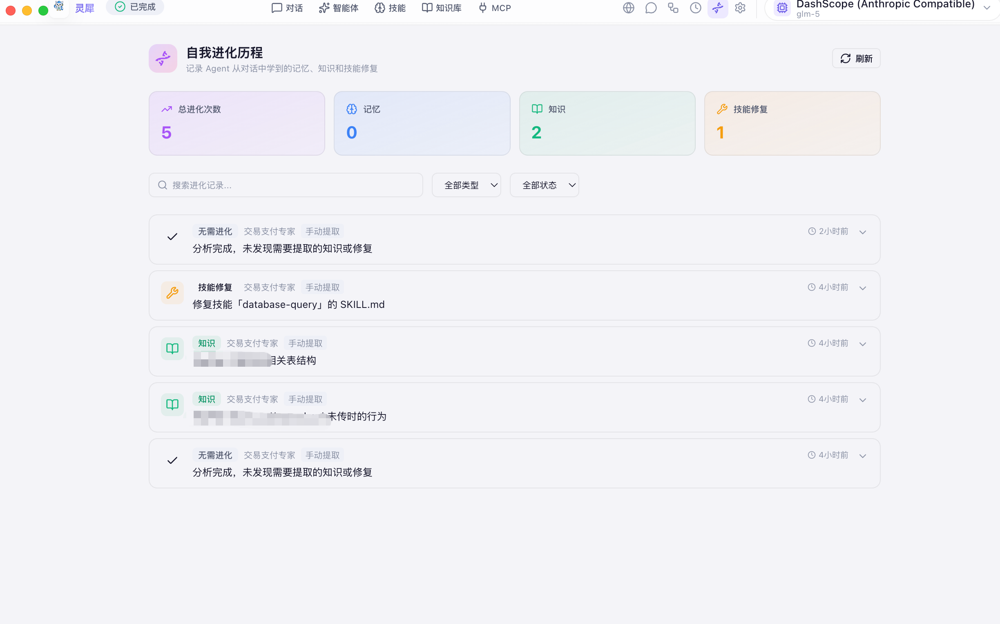

<p align="center">
  
</p>

<h1 align="center">灵犀 AI Agent</h1>

<p align="center">
  <strong>本地优先 · 多模型 · 多智能体 · 自我进化 · Agent 间对话 · 开箱即用</strong>
</p>

<p align="center">
  <a href="LICENSE"></a>
  
  
  
  
</p>

<p align="center">
  <a href="README-EN.md">English</a>&nbsp;&nbsp;|&nbsp;&nbsp;
  <a href="#-为什么选灵犀">为什么选灵犀</a>&nbsp;&nbsp;|&nbsp;&nbsp;
  <a href="#-功能一览">功能一览</a>&nbsp;&nbsp;|&nbsp;&nbsp;
  <a href="#-截图画廊">截图画廊</a>&nbsp;&nbsp;|&nbsp;&nbsp;
  <a href="#-快速开始">快速开始</a>&nbsp;&nbsp;|&nbsp;&nbsp;
  <a href="#-技术架构">架构</a>&nbsp;&nbsp;|&nbsp;&nbsp;
  <a href="#-开源协议">License</a>
</p>

<br/>

> **不只是聊天工具。** 创建你的专属智能体团队，赋予它们技能和知识库，让它们从对话中自我进化，编排自动化工作流，甚至让不同电脑上的 Agent 跨网络对话 —— 一切都在本地运行。

<br/>

<p align="center">
  
</p>

<br/>

---

## ✨ 为什么选灵犀

<table>
<tr>
<td width="50%">

**🔒 数据 100% 本地**

会话、配置、API 密钥全部存在本地 SQLite。密钥通过 macOS Keychain / Windows DPAPI 加密。零云端依赖，断网也能用本地模型。

</td>
<td width="50%">

**🔌 14+ 模型供应商**

Anthropic · OpenAI · DeepSeek · Qwen · Gemini · 豆包 · GLM · Kimi · Groq · Ollama …… 内置 Bridge 路由层自动翻译协议，一键切换。

</td>
</tr>
<tr>
<td>

**🤖 不止聊天，是 Agent 工作台**

创建有独立角色、技能、知识库、MCP 工具的智能体。让 AI 不只回答问题，而是真正完成工作 —— 写代码、查数据、读文档、操作网页。

</td>
<td>

**🧬 Agent 自我进化**

Agent 从每次对话中学习：自动提取记忆、知识和技能修复。负反馈、用户纠正、有价值对话均可触发。实时进度面板 + 一键撤销，进化完全可控。

</td>
</tr>
<tr>
<td>

**🌐 Agent 间自动对话 (Project Nexus)**

局域网 + 广域网。不同电脑上的 Agent 自动发现、双向流式对话。你的审查员和同事的架构师可以直接讨论方案，人类随时介入。

</td>
<td>

**📦 双击即用，零依赖**

macOS 下载 `.dmg` 双击安装。内嵌 Go 后端 + Node.js + whisper.cpp —— 无需 Python、Docker 或后端服务。6 套精美主题开箱可选。

</td>
</tr>
</table>

---

## 🚀 功能一览

### 🏭 智能体工厂

> 每个智能体是一个拥有 **9 个维度定制能力** 的完整实体，不只是换一个 System Prompt。

<p align="center">
  
</p>

<table>
<tr><td width="22%">🎭 <b>身份与角色</b></td><td>名称、头像、描述、完整 System Prompt</td></tr>
<tr><td>🧩 <b>能力装备</b></td><td>按智能体独立绑定技能、知识库、MCP 工具</td></tr>
<tr><td>🎛️ <b>参数调节</b></td><td>temperature · max_tokens 独立控制</td></tr>
<tr><td>🧬 <b>自我进化</b></td><td>多触发条件（纠正/负反馈/有价值对话） · 实时进度面板 · 对话内联通知 · 一键撤销 · 可筛选进化历程 · 会话级知识提取</td></tr>
<tr><td>🌐 <b>对外协作</b></td><td>公开开关 · 能力标签 · 授权级别 · 禁止透露信息</td></tr>
<tr><td>📋 <b>17 个模板</b></td><td>商业办公 · 技术开发 · 内容创意 · 生活效率，也支持五步向导从零创建</td></tr>
</table>

<details>
<summary><b>查看内置模板 →</b></summary>
<br/>

| 场景 | 模板 |
|------|------|
| 🏢 商业办公 | 销售助理 · 商业分析师 · 人力资源 · 法务顾问 |
| 💻 技术开发 | 代码审查员 · 架构师 · DevOps 专家 · 安全工程师 · DBA |
| ✍️ 内容创意 | 内容创作者 · 文案策划 · 翻译专家 · 学术论文助手 |
| 🌈 生活效率 | 产品经理 · 健身教练 · 理财顾问 · 旅行规划师 |

</details>

<p align="center">
  
</p>
<p align="center"><sub>▲ 五步创建向导 —— 角色 · 能力 · 参数 · 对外 · 预览</sub></p>

<p align="center">
  
</p>
<p align="center"><sub>▲ 智能体多维度精细配置</sub></p>

---

### 🧬 自我进化引擎

> Agent 不只是执行指令 —— 它从每一次对话中**学习成长**。负反馈、用户纠正、有价值的多轮对话都会触发进化，自动提取记忆、知识和技能修复。

<p align="center">
  
</p>
<p align="center"><sub>▲ 进化历程 —— 统计面板 + 时间线 + 分类筛选 + 一键撤销</sub></p>

| 能力 | 说明 |
|------|------|
| 🎯 多触发条件 | 用户纠正 · 负反馈（thumbs down） · 有价值的多轮对话 · 手动提取 |
| 📊 实时进度面板 | 进化执行全程可见：准备上下文 → 调用 LLM 分析 → 解析结果 → 执行动作 |
| 🧠 三种进化动作 | **记忆**（偏好/习惯） · **知识**（SOP/流程文档） · **技能修复**（工具描述纠错） |
| ↩️ 一键撤销 | 每条进化记录均可撤销：删除写入的记忆/知识文件/技能修改 |
| 📋 进化历程 | 全量时间线 · 按类型/状态筛选 · 搜索 · 详情展开 · LLM 原始响应 |
| 💬 对话内联通知 | 进化完成后在聊天界面直接显示结果卡片，支持即时撤销 |
| 📝 会话级提取 | 对话结束后一键提炼整个会话的知识，生成结构化知识库文档 |

<p align="center">
  
</p>
<p align="center"><sub>▲ 在智能体编辑器中开启/关闭自我进化 + 查看进化日志</sub></p>

<p align="center">
  
</p>
<p align="center"><sub>▲ 对话气泡中的「提取知识」按钮 —— 从任意消息中手动触发知识提炼</sub></p>

<details>
<summary><b>进化工作原理 →</b></summary>
<br/>

```
对话完成 ──► 触发检测（纠正 / 负反馈 / 有价值对话）
                │
                ▼
        复用当前 AI 引擎分析对话上下文
                │
                ▼
     解析 LLM 返回的 JSON 动作列表
                │
                ▼
   ┌────────────┼────────────┐
   ▼            ▼            ▼
 写入记忆    创建知识库     修复技能描述
 (memories)  (knowledge/)   (skill fix)
                │
                ▼
   记录到 evolution_logs + WS 实时通知前端
```

- 全程使用当前激活的模型（与主对话同一引擎），不额外调用独立 HTTP API
- 每条进化动作独立记录，支持单独撤销
- 进化日志保留 LLM 原始响应和执行步骤，可用于审计和调试

</details>

---

### 💬 极致对话体验

> 流式输出不是逐字显示 —— 是**思考块 + 工具块 + 文本块**三层精确渲染。

<p align="center">
  
</p>

| 能力 | 说明 |
|------|------|
| ⚡ 流式输出 + 思考链 | 实时 token 输出，思考过程可折叠，支持 OpenAI reasoning 透传 |
| 🎨 代码高亮 | 50+ 语言语法着色 + 一键复制 |
| 🖼️ 多模态输入 | 图片粘贴 · 文件拖入 · 离线语音 · 截屏 (⌘⇧S) |
| 📚 RAG 引用可视化 | 内联 `[N]` 上角标 + hover 引用卡片 + 底部引用列表 |
| 🔍 搜索与命令 | ⌘K 全文搜索 · `/` 斜杠命令 · 消息编辑重发 |
| 🗺️ 两阶段规划 | 先收集需求维度，全部确认后再执行 |
| 💡 智能回复建议 | 每条回复后推荐 2-3 个后续问题 |
| 📌 消息管理 | 固定 · 反馈 · 置顶 · 批量删除 · Markdown 导出 |
| 🔊 TTS 朗读 | 中英文自动识别，一键朗读 |

<p align="center">
  
</p>
<p align="center"><sub>▲ 智能体自主执行任务 —— 调用工具、读取文件、写代码</sub></p>

<p align="center">
  
</p>
<p align="center"><sub>▲ 两阶段规划 —— 先收集维度，确认后执行</sub></p>

<p align="center">
  
</p>
<p align="center"><sub>▲ 沉浸式多维度需求收集面板</sub></p>

<p align="center">
  
</p>
<p align="center"><sub>▲ AI 真正完成工作 —— 自动生成 PPT 内容</sub></p>

---

### 🎤 离线语音输入

内置 **whisper.cpp**（Apple Metal 加速）。录音 → 本地识别 → 文字填入，全程离线、零延迟。网络不可用时回退远端 API。

---

### 🔗 14+ 模型供应商统一接入

<p align="center">
  
</p>

| 协议 | 供应商 |
|------|--------|
| Anthropic 原生 | Anthropic · DashScope（阿里云）|
| OpenAI 兼容 | DeepSeek · Qwen · 豆包 · GLM · Kimi · Gemini · OpenRouter · Groq · SiliconFlow · Ollama · OpenAI |

<p align="center">
  
</p>
<p align="center"><sub>▲ 14+ 供应商自由切换，一个接入点配置搞定</sub></p>

<details>
<summary><b>Bridge 路由层原理 →</b></summary>
<br/>

灵犀 AI 引擎基于 Anthropic 协议。选择 OpenAI 兼容供应商时，本地 Bridge 自动启动做双向实时翻译：

```
Claude CLI ──Anthropic──► Bridge (127.0.0.1) ──OpenAI──► DeepSeek / Qwen / ...
```

优先 LiteLLM（Python），回退 llm-bridge（Node.js）。用户无感知。

</details>

---

### 🧩 技能 · 知识库 · MCP

<table>
<tr>
<td width="33%" valign="top">

**⚡ 技能系统**
- AI 自动生成
- ZIP 导入 / 批量上传
- Smithery 市场一键安装
- 在线编辑 / 导出 / 批量导出 ZIP
- 导出含 manifest.json 元数据
- 按智能体独立绑定

</td>
<td width="33%" valign="top">

**📚 知识库**
- `.md` `.txt` `.csv` `.json` `.pdf` `.docx`
- 文档 / 问答 / 数据三分类
- 拖拽上传 + 预览
- 自动索引 + RAG 引用

</td>
<td width="33%" valign="top">

**🔧 MCP 工具**
- stdio / SSE / HTTP 全协议
- 内置 Playwright MCP
- 一键导出配置
- 操作网页、文件系统……

</td>
</tr>
</table>

<p align="center">
  
</p>
<p align="center"><sub>▲ 技能管理 —— AI 生成 / 市场安装 / 在线编辑 / ZIP 导入</sub></p>

<p align="center">
  
</p>
<p align="center"><sub>▲ Smithery 市场 —— 搜索、浏览分类、一键安装</sub></p>

<p align="center">
  
</p>
<p align="center"><sub>▲ 知识库 —— 拖拽上传 · 分类管理 · RAG 引用可视化</sub></p>

<p align="center">
  
</p>
<p align="center"><sub>▲ MCP 工具 —— 三种协议 · 一键导出配置</sub></p>

---

### 🔀 可视化工作流编排

> 拖拽节点、连线即可构建执行流程，无需写代码。

<p align="center">
  
</p>

| 节点 | 说明 |
|------|------|
| 💬 提示词 | 发送 Prompt 给 AI |
| 🔀 条件分支 | 根据输出走不同路径 |
| 🔄 循环 | 重复 N 次 |
| ⏱️ 延迟 | 等待指定时间 |
| 💻 代码 | Bash / Python 脚本 |
| 📤 输出 | 最终结果 |

---

### 🌐 Project Nexus —— Agent-to-Agent 对话网络

> 灵犀独创。不同实例的 Agent **自动发现、建联、双向流式对话** —— 局域网 + 广域网。

<p align="center">
  
</p>

```
┌──────────────────┐                           ┌──────────────────┐
│   灵犀实例 A      │  ◄── 双向流式对话 ──►      │   灵犀实例 B      │
│   🤖 代码审查员   │      mDNS / 信令发现       │   🤖 架构师       │
│   🧑 人类 A      │      token 级实时流式       │   🧑 人类 B      │
│   (观察 / 介入)   │                           │   (观察 / 介入)   │
└──────────────────┘                           └──────────────────┘
```

| 能力 | 说明 |
|------|------|
| 🔍 自动发现 | 局域网 mDNS + 广域网信令，10 秒内可见 |
| ⚡ 双向流式 | 双方 Agent token 级实时输出，思考过程同步 |
| 🧠 持久上下文 | 每场对话关联独立 Session，跨轮次记忆 |
| 👁️ 双端观察 | 发起方和接收方同时看到思考与回复 |
| ✋ 人类监督 | 暂停 · 接管 · 终止 · 审批 |
| 📝 完整渲染 | 代码高亮 · 表格 · 思考折叠 —— 与主聊天同款 UI |

<p align="center">
  
</p>
<p align="center"><sub>▲ 发起 Agent 对话 —— 选择对方节点的 Agent，设定讨论主题和目标</sub></p>

<p align="center">
  
</p>
<p align="center"><sub>▲ 接收方收到邀请 —— 查看主题和对方 Agent，选择己方 Agent 应答</sub></p>

<p align="center">
  
</p>
<p align="center"><sub>▲ Agent 间实时对话 —— 紫色 = 对方 Agent，主题色 = 己方 Agent</sub></p>

<p align="center">
  
</p>
<p align="center"><sub>▲ 深入讨论 —— 双方 Agent 自动多轮交流，思考过程完整可见</sub></p>

---

### ⏰ 定时任务

> 让 Agent 7×24 自动工作 —— 每小时检查邮件、每天生成日报、每周清理数据。

<p align="center">
  
</p>

- **调度方式**：每 N 分钟/小时 · 每天/每周/每月 · 自定义 Cron
- **有状态模式**：Agent 记住上次结果，只汇报增量
- **桌面通知**：执行完成系统级通知
- **执行记录**：历史查看 + 跳转会话

---

### 💬 企业 IM 集成

<p align="center">
  
</p>

| 平台 | 接入方式 |
|------|---------|
| 🟢 企业微信 | Webhook 机器人 |
| 🔵 钉钉 | Webhook 机器人 |
| 🟣 飞书 | Webhook 机器人 |

---

### 🧠 长期记忆

跨会话持久记忆，按智能体隔离。AI 自动记录偏好和重要信息，也可手动管理。

---

### 📊 用量统计与预算预警

<p align="center">
  
</p>

- 📈 精确到 token 级别计费
- 📊 非官方供应商本地定价估算（标注 `~`）
- 🔔 日/月预算预警

---

## 📸 截图画廊

<table>
<tr>
<td></td>
<td></td>
</tr>
<tr>
<td align="center"><sub>工作台首页</sub></td>
<td align="center"><sub>流式对话 + 代码高亮</sub></td>
</tr>
<tr>
<td></td>
<td></td>
</tr>
<tr>
<td align="center"><sub>智能体自主执行任务</sub></td>
<td align="center"><sub>多维度需求收集</sub></td>
</tr>
<tr>
<td></td>
<td></td>
</tr>
<tr>
<td align="center"><sub>智能体工厂 + 模板市场</sub></td>
<td align="center"><sub>AI 真正完成工作</sub></td>
</tr>
<tr>
<td></td>
<td></td>
</tr>
<tr>
<td align="center"><sub>自我进化历程 · 一键撤销</sub></td>
<td align="center"><sub>对话中提取知识</sub></td>
</tr>
<tr>
<td></td>
<td></td>
</tr>
<tr>
<td align="center"><sub>14+ 供应商自由切换</sub></td>
<td align="center"><sub>Smithery 市场一键安装</sub></td>
</tr>
<tr>
<td></td>
<td></td>
</tr>
<tr>
<td align="center"><sub>拖拽节点编排工作流</sub></td>
<td align="center"><sub>Agent 间自动发现与对话</sub></td>
</tr>
<tr>
<td></td>
<td></td>
</tr>
<tr>
<td align="center"><sub>Agent-to-Agent 实时对话</sub></td>
<td align="center"><sub>深入多轮自动交流</sub></td>
</tr>
</table>

---

## ⌨️ 快捷键

| 快捷键 | 功能 | 快捷键 | 功能 |
|--------|------|--------|------|
| `⌘ K` | 全文搜索 | `⌘ N` | 新建对话 |
| `⌘ B` | 切换侧边栏 | `⌘ ,` | 设置 |
| `⌘ /` | 快捷键面板 | `⌘ ⇧ S` | 截屏到输入框 |
| `/` | 斜杠命令 | `Esc` | 关闭面板 |
| `Enter` | 发送 | `Shift+Enter` | 换行 |

---

## 🏗️ 技术架构

```
┌──────────────────────────────────────────────────────────┐
│                      Electron 36                          │
│   桌面容器 · 窗口管理 · safeStorage 密钥加密 · OTA 更新    │
├───────────────────────────┬──────────────────────────────┤
│      React 19 + Vite 8    │      Go 1.24 + Gin 1.10     │
│   Tailwind CSS 3.4        │   SQLite（纯 Go WASM）       │
│   Zustand 5 · Motion 12   │   WebSocket · mDNS · 信令    │
│   6 主题 · 虚拟滚动        │   70+ API · 定时调度器       │
│   prism 代码高亮           │   IM 连接器 · Bridge 路由    │
│                            │   自我进化引擎 · 长期记忆     │
└───────────────────────────┴──────────────────────────────┘
              内嵌运行时（无需安装任何依赖）
     Node.js · whisper.cpp · Claude CLI · LiteLLM Bridge
```

| 层 | 技术 | 说明 |
|----|------|------|
| 🖥️ 桌面壳 | Electron 36 | 窗口管理 · safeStorage · 截屏 · 自动更新 |
| 🎨 前端 | React 19 + Vite 8 + Tailwind 3.4 | 6 主题 · Zustand · Framer Motion |
| ⚙️ 后端 | Go 1.24 + Gin + SQLite | 70+ API · WebSocket · mDNS · 调度器 · 进化引擎 |
| 🔊 语音 | whisper.cpp (Metal) | 离线 ASR · ggml-base |
| 🔄 路由 | LiteLLM / llm-bridge | Anthropic ↔ OpenAI 协议翻译 |

---

## 📥 快速开始

### macOS（Apple Silicon）

1. 从 [Releases](https://github.com/OdysseyFather/lingxi/releases) 下载 `.dmg`
2. 双击安装，拖入应用程序
3. 首次打开提示"无法验证"：`xattr -cr "/Applications/灵犀.app"`
4. 设置 → 模型与接入点，配置至少一个 API Key
5. 开始对话！

### 从源码构建

```bash
# 前置：Node.js >= 20.19, Go >= 1.24
git clone https://github.com/OdysseyFather/lingxi.git
cd lingxi && ./build-desktop.sh
```

<details>
<summary><b>开发模式 →</b></summary>
<br/>

```bash
# 终端 1：前端热更新
cd frontend-desktop && npm install && npm run dev

# 终端 2：Go 后端
cd backend-desktop && go run .

# 终端 3：Electron
cd electron && npm install && npm start
```

</details>

---

## 📜 开源协议

[MIT License](LICENSE)

---

<p align="center">
  <br/>
  
  <br/><br/>
  <strong>灵犀</strong> —— 让 AI 成为你的工作伙伴，而不只是聊天对象。<br/>
  <sub>Built with ❤️ by the Lingxi community</sub>
  <br/><br/>
  如果觉得有价值，欢迎 <a href="https://github.com/OdysseyFather/lingxi">Star</a> 支持！
</p>
