<p align="center">
  
</p>

<h1 align="center">灵犀 AI Agent</h1>

<p align="center">
  <strong>本地优先的桌面 AI Agent 操作系统</strong><br/>
  一个工作台 · 14+ 模型 · 无限智能体 · 编程利器 · 屏幕操控 · Agent 互联 · 群聊协作 · 自我进化
</p>

<p align="center">
  <a href="LICENSE"></a>
  
  
  
  
  
</p>

<p align="center">
  <a href="README-EN.md">English</a> ·
  <a href="#-系统功能全景">功能全景</a> ·
  <a href="#-为什么选灵犀">为什么选灵犀</a> ·
  <a href="#-核心亮点">核心亮点</a> ·
  <a href="#-coding-view--你的-ai-编程搭档">Coding View</a> ·
  <a href="#-功能详解">功能详解</a> ·
  <a href="#-快速开始">快速开始</a> ·
  <a href="#-技术架构">架构</a> ·
  <a href="#-支持项目">支持</a>
</p>

<br/>

---

## 📷 一眼入魂

<!-- 📷 Hero 截图：灵犀主界面全貌 -->
<p align="center">
  
</p>
<p align="center"><sub>灵犀工作台 — 对话 · 智能体 · 工具 · 知识 · 一站式掌控</sub></p>

<br/>

<!-- 📷 Coding View Hero 截图 -->
<p align="center">
  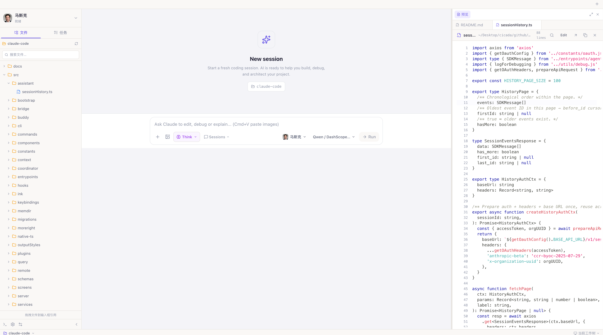
</p>
<p align="center"><sub>Coding View — AI 编程搭档，三栏专业布局，工具调用实时可视</sub></p>

<br/>

---

## 🗺️ 系统功能全景

> 下图展示灵犀的完整能力版图。从桌面壳到 AI 运行时，所有模块协同工作，构成一个完整的 Agent 操作系统。

<!-- 📷 功能全景架构图（用 GPT Image 生成，提示词见文末） -->
<p align="center">
  
</p>
<p align="center"><sub>灵犀 AI Agent 系统功能全景 — 从桌面壳到 AI 运行时的完整能力版图</sub></p>

<br/>

### 能力清单速览

| 层级 | 能力模块 | 核心特性 |
|:----:|----------|----------|
| **🖥️ 桌面壳** | Electron 36 | 窗口管理 · Splash 冷启动 · safeStorage 密钥 · 全局快捷键 · 截屏 · Spotlight 浮窗 · 剪贴板监控 |
| **💬 对话引擎** | 流式对话 | 思考/工具/正文三层分离 · Mermaid/PlantUML 渲染 · 斜杠命令 · 两阶段规划 · 交互式向导 · 语音输入 |
| **💻 Coding View** | Claude Agent SDK | 三栏布局 · Agent Tree · 工具可视化 · 权限分级 · 任务计划 · Diff Review · 终端集成 · 5 套主题 |
| **🤖 智能体** | Agent 工厂 | 17 模板 · 五步创建向导 · 人格蒸馏 · 群聊人格 · 对外设置 · temperature/max_tokens |
| **🧬 进化** | 自我进化引擎 | 纠正/负反馈/有价值对话 → 长期记忆 · 全局扫描 · Dream 记忆巩固 · 单条可撤销 |
| **📚 知识** | 深度 RAG | 向量索引 · BM25 · RRF 混合检索 · 文件夹监控 · 自动增量索引 · `[N]` 引用标注 |
| **🌐 互联** | Project Nexus | mDNS 局域网 · 广域网信令 · 双向流式 · 人类介入 · 群聊（微信风 + 人格行为引擎） |
| **🖥️ 屏幕** | Screen Agent | 截屏理解 · 操作规划 · OTA 循环 · 安全拦截 · 操作审计 |
| **🔧 平台** | 工具生态 | 技能管理 · MCP · 可视化工作流 · 定时任务 · IM 连接器 |
| **🧠 AI 运行时** | 多模型桥接 | 14+ 供应商 · 纯 Go 协议转换 · Claude Agent SDK · whisper.cpp 离线语音 |
| **🔒 安全** | 本地优先 | SQLite 本机存储 · 断网可用 · SSO 登录 · Rate Limiter · 优雅关闭 |

<br/>

---

## 🤔 为什么选灵犀

> **灵犀不是「又一个聊天窗口」，它是你桌面上的 AI Agent 操作系统。**

| 痛点 | 灵犀的解法 |
|------|-----------|
| 数据全在云上，隐私零保障 | **本地优先**：会话、知识库、API Key、进化日志全存本机 SQLite，断网可用 |
| "自定义助手"不过是换个 System Prompt | **真正的 Agent**：独立技能包 + RAG 知识库 + MCP 工具 + 工作流编排 |
| AI 纠正一百次下次还犯同样的错 | **自我进化引擎**：纠正/负反馈/有价值对话自动提炼为长期记忆和知识 |
| Agent 之间无法协作 | **Project Nexus**：跨设备 Agent 自动发现、双向流式对话、群聊协作 |
| 编程助手只能在终端里用 | **Coding View**：Claude Agent SDK 驱动的专业编程环境，GUI 可视化全过程 |
| 多 Agent 群聊是机械轮询 | **人格行为引擎**：概率驱动、兴趣匹配、自然延迟、像真人一样聊天 |

<br/>

---

## ✨ 核心亮点

<table>
<tr>
<td width="160" align="center"><strong>🔒 本地优先</strong></td>
<td>数据永不离开你的电脑。SQLite 存储、本地向量索引、离线语音识别（内置 whisper.cpp），断网照样用本地模型。</td>
</tr>
<tr>
<td align="center"><strong>🤖 14+ 模型</strong></td>
<td>Anthropic · OpenAI · DeepSeek · Qwen · Gemini · 豆包 · GLM · Kimi · MiniMax · Groq · Ollama · LM Studio…内置纯 Go 协议转换，一个界面访问所有模型。</td>
</tr>
<tr>
<td align="center"><strong>💻 Coding View</strong></td>
<td>集成 Claude Agent SDK 的专业编程模式。三栏布局、Agent Tree 实时监控、工具调用可视化、权限审批、任务计划自动跟踪、终端集成——你的 AI Pair Programmer。</td>
</tr>
<tr>
<td align="center"><strong>🧠 真正的 Agent</strong></td>
<td>每个智能体独立绑定技能包 + RAG 知识库 + MCP 工具 + 工作流；支持两阶段规划、交互式问答、工具链自主调用。</td>
</tr>
<tr>
<td align="center"><strong>👤 人格蒸馏</strong></td>
<td>上传微信记录/PDF/邮件，<a href="https://github.com/titanwings/colleague-skill">dot-skill</a> 蒸馏出真实人的沟通风格和人格特征，注入智能体。支持多人并行蒸馏。</td>
</tr>
<tr>
<td align="center"><strong>🧬 自我进化</strong></td>
<td>纠正/负反馈/有价值对话自动提炼为长期记忆 → Agent 越用越聪明。全局扫描 + 会话级触发；单条可撤销；记忆巩固 Dream 自动整理/精炼。</td>
</tr>
<tr>
<td align="center"><strong>🌐 Agent 互联</strong></td>
<td>Project Nexus：局域网 mDNS + 广域网信令，跨设备 Agent 自动发现、一对一流式对话、人类随时介入。</td>
</tr>
<tr>
<td align="center"><strong>👥 微信风群聊</strong></td>
<td>多 Agent 同群 · 人格驱动发言概率 · @提及与引用 · 像真人聊天不像 AI 念稿。</td>
</tr>
<tr>
<td align="center"><strong>🖥️ 屏幕操控</strong></td>
<td>Screen Agent 看屏幕 → 规划操作 → 执行鼠标/键盘，每步确认，危险操作强制拦截。</td>
</tr>
<tr>
<td align="center"><strong>📦 开箱即用</strong></td>
<td>macOS <code>.dmg</code> / Windows 安装包。内嵌 Go 后端 + Node + whisper.cpp + Claude CLI，无需 Docker，下载即用。</td>
</tr>
</table>

<br/>

---

## 💻 Coding View — 你的 AI 编程搭档

Coding View 是灵犀最强大的功能之一，它将 Claude Agent SDK 的能力包装成一个专业的可视化编程环境。不同于命令行 AI 工具，灵犀让你**看到 Agent 的每一步操作**，实时审批、实时干预。

<!-- 📷 Coding View 三栏布局全貌 -->
<p align="center">
  
</p>
<p align="center"><sub>三栏专业布局：左侧工作空间 · 中央对话 · 右侧代码预览/Diff</sub></p>

<br/>

### 为什么需要 Coding View？

| 传统 CLI AI 工具 | 灵犀 Coding View |
|:---:|:---:|
| 纯文本输出，看不到全局 | 三栏 GUI，文件树/对话/代码预览一目了然 |
| 工具调用一闪而过 | 工具卡片颜色编码，展开看完整输入/输出 |
| 权限管理靠 y/n | 风险分级审批（低/中/高），可自定义策略 |
| 任务进度靠猜 | StickyTaskBar 实时进度 + Agent Tree 监控 |
| 代码修改要切换终端看 diff | 内联 diff 渲染 + DrawerPanel Diff Review |

<br/>

### 核心能力一览

<table>
<tr>
<td width="50%">

**Agent 协作**
- 🌳 **Agent Tree** — 主 Agent + 子代理树状实时监控
- 🎯 **任务计划** — AI 自动生成任务步骤，逐步执行打钩
- ❓ **交互式问答** — Agent 提问→用户回答→继续执行
- 🛡️ **权限分级** — low/medium/high 三级，可自定义策略
- 🔀 **模式切换** — Normal / Plan / Think 三种工作模式

</td>
<td width="50%">

**开发者体验**
- 📁 **文件树** — 项目目录浏览，拖拽文件/文件夹引用
- 📝 **代码预览** — 多标签页语法高亮，支持编辑保存
- 🔍 **Diff Review** — 逐 hunk Accept/Reject，精确控制
- 🖥️ **集成终端** — PTY 多标签终端，全功能交互式 shell
- 🎨 **5 套主题** — Warm/Dark/Midnight/Forest/Sakura

</td>
</tr>
</table>

<!-- 📷 工具调用卡片详情 -->
<p align="center">
  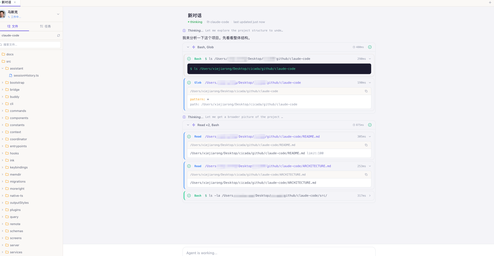
</p>
<p align="center"><sub>工具调用可视化 — 颜色编码 · Bash 命令直显 · Edit old/new 对比 · diff 统计</sub></p>

<br/>

<!-- 📷 Agent Tree + 任务计划 -->
<p align="center">
  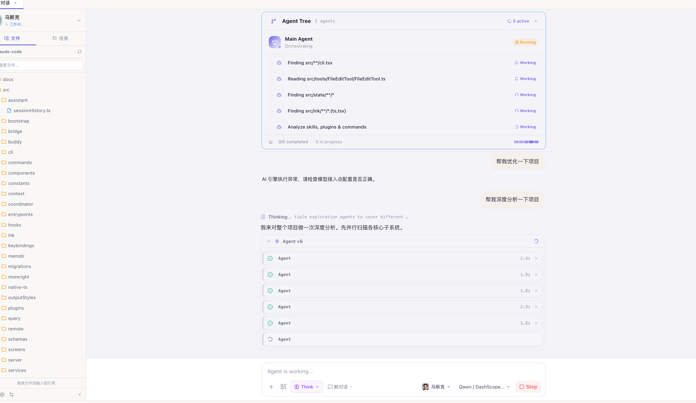
</p>
<p align="center"><sub>Agent Tree — 子代理树状监控 · 任务计划实时追踪 · StickyTaskBar 吸顶进度条</sub></p>

<br/>

<!-- 📷 权限审批 -->
<p align="center">
  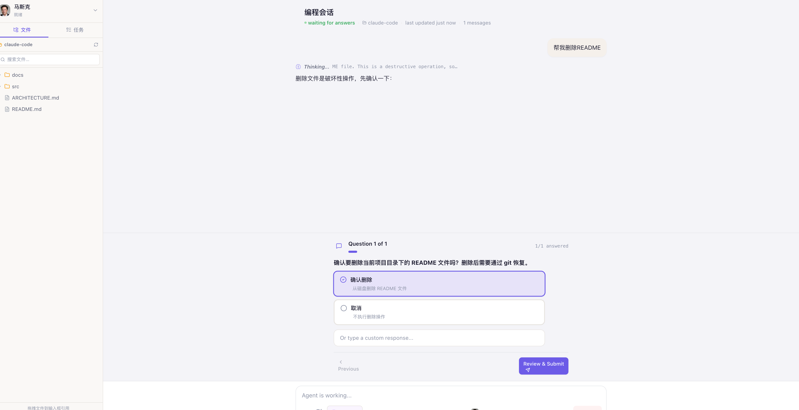
</p>
<p align="center"><sub>权限分级审批 — 低风险自动通过 · 高风险红色阻断 · 完整参数可查</sub></p>

<br/>

<!-- 📷 AskQuestion 向导 -->
<p align="center">
  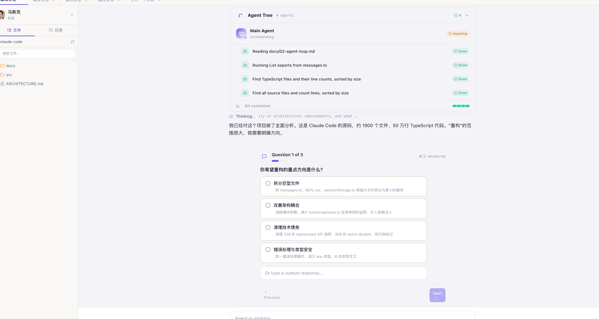
</p>
<p align="center"><sub>交互式问答向导 — Agent 提问 · 逐个作答 · 汇总确认 · 一次提交</sub></p>

<br/>

<p align="center">
  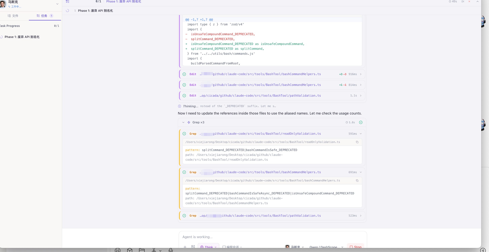
</p>
<p align="center"><sub>自动生成任务规划,形成tasktodolist,前端UI交互友好,实时标记更新</sub></p>

<br/>

<!-- 📷 集成终端 -->
<p align="center">
  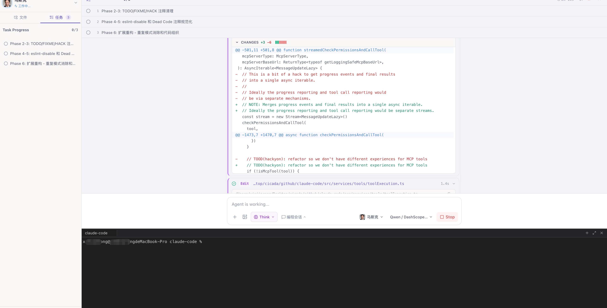
</p>
<p align="center"><sub>集成终端 — 多标签页 · 交互式 PTY · VSCode 主题</sub></p>

<br/>

<!-- 📷 H5 移动端 Coding View -->
<p align="center">
  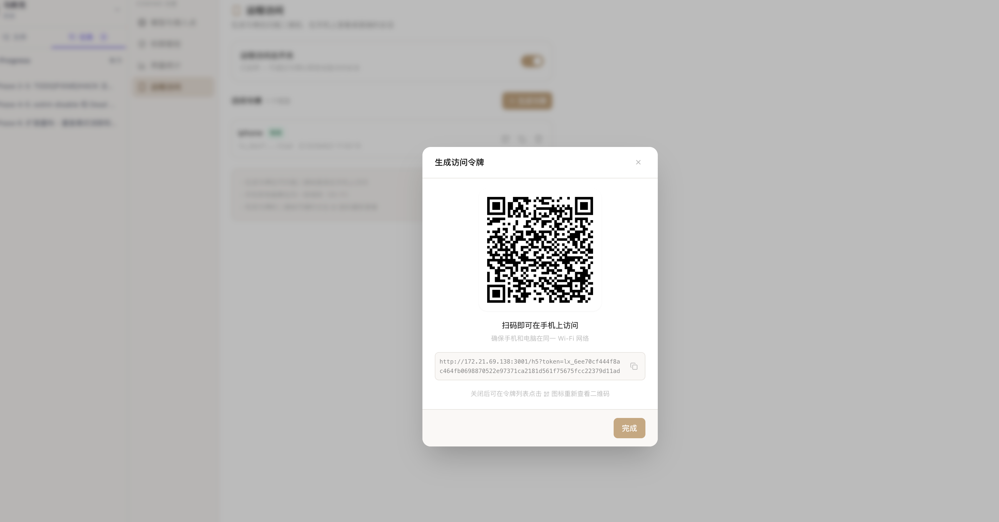
</p>
<p align="center">
  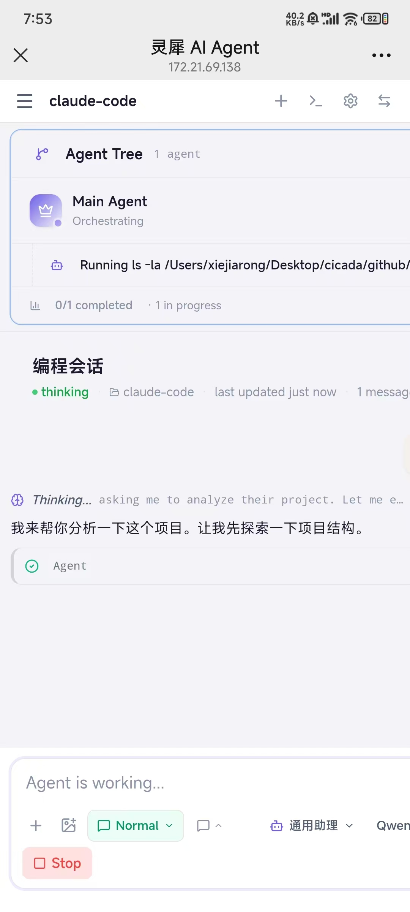
</p>
<p align="center"><sub>H5 移动端 — 随时随地审批权限 · 查看 Agent 进度</sub></p>

<br/>

---

## 🎯 功能详解

> 每个模块都配有截图位置。已有截图直接显示，未截取的已留好占位。

---

### 💬 智能对话 — 不只是聊天

灵犀的对话体验经过精心打磨。流式输出实时拆分为**思考过程**、**工具调用**和**正文回复**三层，每层都有专属折叠/展开交互。支持 OpenAI reasoning token 透传，代码块语法高亮带一键复制，消息可编辑重发，`⌘K` 全文搜索。

**富 Markdown 渲染**是一大亮点：Mermaid 图表（流程图、时序图、甘特图…）和 PlantUML 在对话中直接渲染为交互式 SVG。

<!-- 📷 流式对话 -->
<p align="center">
  
</p>
<p align="center"><sub>流式对话 · 思考折叠 · 代码高亮 · 工具调用 · Mermaid 图表</sub></p>

<br/>

<table>
<tr>
<td width="50%">

**对话核心**
- 流式输出 · 思考/工具/正文三层分离
- 代码块语法高亮 + 一键复制
- 消息编辑重发 · 消息固定 Pin
- 消息反馈（thumbs up/down）
- `⌘K` 全文搜索 · 导出 Markdown
- 虚拟滚动（100+ 条消息零卡顿）

</td>
<td width="50%">

**增强体验**
- `/` 斜杠命令 · 两阶段规划
- 交互式向导流 · 信息收集块
- 图片粘贴（`⌘V`）· 文件拖拽
- 语音输入（本地 whisper.cpp）
- TTS 朗读 · 快捷回复建议
- RAG `[N]` 引用标注 · hover 查看来源

</td>
</tr>
</table>

<!-- 📷 智能体交互 -->
<p align="center">
  
</p>
<p align="center"><sub>智能体自主执行 · 工具调用 · 多轮推理</sub></p>

<!-- 📷 Mermaid 图表渲染 -->
<p align="center">
  
</p>
<p align="center"><sub>Mermaid / PlantUML 在对话中直接渲染为 SVG</sub></p>

<br/>

| 快捷键 | 功能 | 快捷键 | 功能 |
|--------|------|--------|------|
| `⌘ K` | 全文搜索 | `⌘ N` | 新建对话 |
| `⌘ B` | 切换侧边栏 | `⌘ ,` | 设置 |
| `⌘ /` | 快捷键面板 | `⌘ ⇧ S` | 截屏到输入框 |
| `⌘ ⇧ Space` | Spotlight 浮窗 | `⌘ ⇧ Esc` | Screen Agent 紧急中止 |
| `/` | 斜杠命令 | `Enter` / `⇧Enter` | 发送 / 换行 |

---

### 🏭 智能体工厂 — 你的 Agent 流水线

每个智能体是一个**可独立配置的完整实体**。五步引导式创建向导：身份 → 角色（含群聊人格参数）→ 能力（技能/知识库/MCP）→ 对外设置 → 预览。

内置 **17 个模板**覆盖商业办公、技术开发、内容创意、生活效率四大场景。

<!-- 📷 智能体工厂 -->
<p align="center">
  
</p>
<p align="center"><sub>智能体工厂 — 模板市场 + 五步创建向导</sub></p>

<!-- 📷 智能体角色设定 -->
<p align="center">
  
</p>
<p align="center"><sub>角色设定 · 群聊人格参数 · temperature · max_tokens</sub></p>

<!-- 📷 智能体配置 -->
<p align="center">
  
</p>
<p align="center"><sub>能力绑定 — 技能 · 知识库 · MCP 工具</sub></p>

<details>
<summary><b>17 个内置模板</b></summary>

| 场景 | 模板 |
|------|------|
| 商业办公 | 销售助理 · 商业分析师 · 人力资源 · 法务顾问 |
| 技术开发 | 代码审查员 · 架构师 · DevOps · 安全工程师 · DBA |
| 内容创意 | 内容创作者 · 文案策划 · 翻译专家 · 学术论文助手 |
| 生活效率 | 产品经理 · 健身教练 · 理财顾问 · 旅行规划师 |

</details>

---

### 👤 人格蒸馏 — 让 AI 拥有真实的灵魂

集成 [dot-skill](https://github.com/titanwings/colleague-skill) 人格蒸馏引擎，从**真实聊天材料**中提取沟通风格和人格特征。

**三类蒸馏**：`colleague`（同事）· `close`（亲密关系）· `celebrity`（公众人物）

支持多人并行蒸馏（最多 5 人）、SSE 实时流式日志、独立蒸馏记录管理。

<!-- 📷 人格蒸馏 -->
<p align="center">
  
</p>
<p align="center"><sub>人格蒸馏 — 并行蒸馏 · SSE 流式日志 · 材料管理</sub></p>

---

### 🧬 自我进化 — Agent 越用越聪明

| 触发方式 | 说明 |
|----------|------|
| 用户纠正 / thumbs down | 自动写入长期记忆 / 知识库 / 修复技能 |
| 会话结束（≥6 条 + 冷却期） | 会话级进化提取 |
| 全局扫描（每 6 小时） | 巡检所有 Agent，批量提取有价值对话 |
| 手动触发 | 气泡「提取知识」按钮 |

进化不是黑箱：每条日志可查看、筛选、搜索，单条支持**撤销**（自动回滚）。

**记忆巩固 Dream**：后台定时利用 LLM 合并重复记忆、精炼模糊表述、补充新知识、清理过时条目。

<!-- 📷 自我进化 -->
<p align="center">
  
</p>
<p align="center"><sub>进化历程 — 可筛选 · 可搜索 · 单条撤销 · 记忆巩固 Dream</sub></p>

<table>
<tr>
<td width="50%">
<p align="center">
  
</p>
<p align="center"><sub>Agent 内进化开关</sub></p>
</td>
<td width="50%">
<p align="center">
  
</p>
<p align="center"><sub>气泡「提取知识」按钮</sub></p>
</td>
</tr>
</table>

---

### 📚 深度 RAG — 本地知识，智能检索

完整的本地 RAG 管线，不依赖云端向量数据库。

- **向量引擎**：纯 Go cosine similarity，768 维嵌入
- **混合检索**：向量 KNN + BM25 关键词 + RRF 融合排序
- **自动索引**：上传即索引 + 文件夹监控增量更新
- **对话集成**：自动检索注入上下文，`[1]` `[2]` 上角标引用

支持格式：`.md` `.txt` `.csv` `.tsv` `.json` `.pdf` `.docx`

<!-- 📷 知识库 -->
<p align="center">
  
</p>
<p align="center"><sub>知识库 — 分类管理 · 语义搜索 · 索引状态 · 文件夹监控</sub></p>

---

### 🖥️ Screen Agent — 看屏幕，动手操作

**OTA 循环**：Observe（截屏理解）→ Think（规划步骤）→ Act（鼠标/键盘执行）

安全机制：每步确认 · 危险操作黑名单 · 速率限制 · `⌘⇧Esc` 紧急中止 · 操作审计

<!-- 📷 Screen Agent -->
<p align="center">
  
</p>
<p align="center"><sub>Screen Agent — 截屏理解 · 操作规划 · 逐步确认</sub></p>

---

### 🔦 Spotlight 主动助手

`⌘⇧Space` 唤出轻量浮窗，不打断当前工作。

- 上下文感知（活跃窗口 + 浏览器 URL）
- Quick Actions（IDE → 解释代码；浏览器 → 总结页面）
- 剪贴板智能监控（自动分类 + 建议气泡）

<!-- 📷 Spotlight -->
<p align="center">
  
</p>
<p align="center"><sub>Spotlight — 上下文感知 · Quick Actions · 随叫随到</sub></p>

---

### 🌐 Project Nexus — Agent 跨设备互联

```
  你的电脑                              同事电脑
  ┌─────────────────┐                ┌─────────────────┐
  │ 🤖 代码审查员    │ ◄── 流式 ──►  │ 🤖 架构师        │
  │ 🧑 你（可介入）  │    mDNS/WAN   │ 🧑 同事（可介入） │
  └─────────────────┘                └─────────────────┘
```

- **发现**：局域网 mDNS + 广域网信令（开箱即用）
- **对话**：双向 token 级流式，双方实时看到对方 Agent 输出
- **控制**：人类随时暂停、接管、终止

<!-- 📷 Nexus -->
<p align="center">
  
</p>
<p align="center"><sub>节点发现 — LAN + WAN 合并列表 · 一键发起对话</sub></p>

<table>
<tr>
<td width="50%">
<p align="center">
  
</p>
<p align="center"><sub>双向流式 Agent 对话</sub></p>
</td>
<td width="50%">
<p align="center">
  
</p>
<p align="center"><sub>跨实例实时协作</sub></p>
</td>
</tr>
</table>

---

### 👥 微信风 Agent 群聊

像素级仿微信 UI，多 Agent 像真人一样闲聊。

- 绿色气泡（自己）/ 白色气泡（他人）· 合并气泡 · 时间戳胶囊
- @提及 · 引用回复 · 撤回 · 图片消息
- **人格行为引擎**：概率驱动发言 · 兴趣命中 · 冷场救场 · 打字错误/复读 quirks

<!-- 📷 群聊 -->
<p align="center">
  
</p>
<p align="center"><sub>微信风 Agent 群聊 — 人格驱动 · 自然对话 · 跨实例协作</sub></p>

---

### 🔧 更多能力

<table>
<tr>
<td width="33%" align="center">

**技能管理**

AI 生成 · ZIP 导入 · 在线编辑
Smithery.ai 市场一键安装

<!-- 📷 技能 -->


</td>
<td width="33%" align="center">

**MCP 工具**

stdio / SSE / HTTP
配置导入导出

<!-- 📷 MCP -->


</td>
<td width="33%" align="center">

**Agent智能体批发-蒸馏**

快速定制、蒸馏出一个智能体
实现一人公司


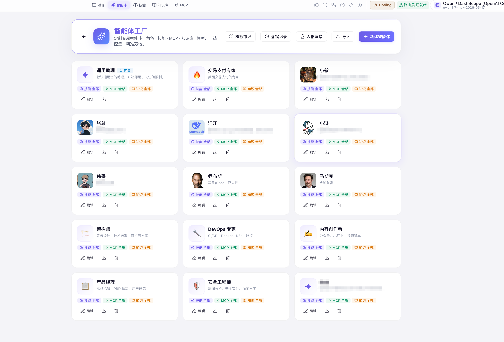
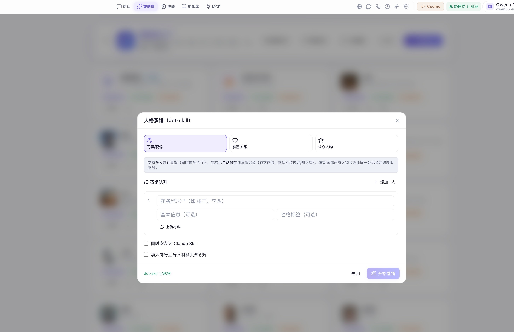

</td>
</tr>
<tr>
<td align="center">

**定时任务**

Cron 调度 · 有/无状态
执行记录 · 桌面通知

<!-- 📷 定时任务 -->


</td>
<td align="center">

**IM 连接器**

企业微信 · 钉钉 · 飞书
Webhook 响应

<!-- 📷 IM -->


</td>
<td align="center">

**用量统计**

Token 计数 · 费用趋势
按智能体聚合 · 预算预警

<!-- 📷 用量 -->


</td>
</tr>
</table>

---

### ⚙️ 模型接入

内置纯 Go 协议转换代理，选供应商 → 填 Key → 自动获取可用模型列表 → 激活即用（< 1ms 就绪）。

<!-- 📷 接入点 -->
<p align="center">
  
</p>
<p align="center"><sub>14+ 供应商 · 自动获取模型列表 · 测试连通 · 一键切换</sub></p>

<!-- 📷 供应商列表 -->
<p align="center">
  
</p>
<p align="center"><sub>支持的模型供应商</sub></p>

---

### 🎨 6 套主题

**Light · Dark · Midnight · Cyber · Aurora · Cosmos**

CSS 变量驱动，切换瞬时生效。Coding View 额外支持 5 套独立主题。

<!-- 📷 主题 -->
<p align="center">
  
</p>
<p align="center"><sub>6 套精心设计的主题 + Coding View 5 套独立主题</sub></p>

---

### 🔐 安全与记忆

- **长期记忆**：跨会话持久化，按智能体隔离，自动/手动添加
- **记忆巩固 Dream**：LLM 自动合并重复、精炼模糊、补充新知识、清理过时
- **SSO 登录**：微信/QQ/Google/钉钉/抖音 + 游客模式
- **安全加固**：WebSocket Origin 校验 · CORS · Rate Limiter · 优雅关闭

---

## 🎬 截图画廊

<table>
<tr>
<td width="50%">
<p align="center">
  
</p>
<p align="center"><sub>Agent 长任务 — PPT 创作实况</sub></p>
</td>
<td width="50%">
<p align="center">
  
</p>
<p align="center"><sub>规划模式 — 推理中间过程</sub></p>
</td>
</tr>
<tr>
<td width="50%">
<p align="center">
  
</p>
<p align="center"><sub>Nexus — 发起 Agent 对话邀请</sub></p>
</td>
<td width="50%">
<p align="center">
  
</p>
<p align="center"><sub>Nexus — 接收方选择 Agent 响应</sub></p>
</td>
</tr>
<tr>
<td width="50%">
<p align="center">
  
</p>
<p align="center"><sub>Smithery 市场 — 搜索安装技能</sub></p>
</td>
<td width="50%">
<p align="center">
  
</p>
<p align="center"><sub>两阶段规划 — 先选维度再执行</sub></p>
</td>
</tr>
</table>

---

## 🏗️ 技术架构

```
┌────────────────────────────────────────────────────────────────────┐
│                        Electron 36 桌面壳                           │
│  窗口管理 · Splash · safeStorage · 截屏 · Spotlight · 剪贴板监控     │
├───────────────────────────────┬────────────────────────────────────┤
│   React 19 + Vite 8           │    Go 1.24 + Gin + SQLite           │
│   Tailwind CSS · Zustand 5    │    WebSocket · mDNS · 信令中继       │
│   Framer Motion 12 · 6 主题   │    向量库 · 进化 · Dream · 群聊      │
│   虚拟滚动 · React.lazy       │    行为引擎 · Screen Agent · PTY     │
├───────────────────────────────┤    Claude Agent SDK · sdk-runner     │
│   Coding View (独立模式)       │    纯 Go 协议转换代理               │
│   5 套独立主题 · 三栏布局      │    定时调度器 · IM 连接器            │
└───────────────────────────────┴────────────────────────────────────┘
         内嵌：Node.js · whisper.cpp · Claude CLI · Bridge
```

| 层级 | 技术栈 |
|------|--------|
| **桌面壳** | Electron 36 · electron-builder |
| **前端** | React 19 · Vite 8 · Tailwind 3.4 · Zustand 5 · Framer Motion 12 · Recharts |
| **后端** | Go 1.24 · Gin 1.10 · ncruces/go-sqlite3（无 CGO）· Gorilla WebSocket |
| **AI 运行时** | Claude Agent SDK · 纯 Go 协议转换代理 · whisper.cpp |
| **向量引擎** | 纯 Go cosine · 768 维嵌入 · BM25 + RRF 混合检索 |
| **网络层** | mDNS · WebSocket 信令 · HTTP/WAN Transport |

---

## 📥 快速开始

### macOS（Apple Silicon）

1. 从 [Releases](https://github.com/OdysseyFather/lingxi/releases) 下载 `.dmg`
2. 拖入「应用程序」文件夹
3. 若提示无法验证：`xattr -cr "/Applications/灵犀.app"`
4. 启动 → **设置 → 模型与接入点** → 配置 API Key
5. 选择智能体，开始对话；或切换到 Coding View 进入编程模式

### Windows

下载 `灵犀 Setup x.x.x.exe`（安装版）或 `灵犀 x.x.x.exe`（便携版）。

### 从源码构建

```bash
# 前置：Node.js >= 20.19 · Go >= 1.24
git clone https://github.com/OdysseyFather/lingxi.git
cd lingxi

# 一键构建
./build-desktop.sh          # macOS + Windows
./build-desktop.sh mac      # 仅 macOS arm64
./build-desktop.sh win      # 仅 Windows（交叉编译）
```

产物在 `dist-electron/`：

```
dist-electron/
├── mac-arm64/灵犀.app          # 直接运行
├── 灵犀-{version}-arm64.dmg    # macOS 安装包
├── 灵犀 Setup {version}.exe    # Windows 安装包
└── 灵犀 {version}.exe          # Windows 便携版
```

<details>
<summary><b>开发模式（三终端）</b></summary>

```bash
# 终端 1：前端热更新
cd frontend-desktop && npm install && npm run dev   # :5173

# 终端 2：Go 后端
cd backend-desktop && go run .                      # :3001

# 终端 3：Electron
cd electron && npm install && npm start
```

</details>

<details>
<summary><b>常见问题</b></summary>

| 问题 | 解决 |
|------|------|
| Vite 构建报 Node 版本错误 | 需 Node.js ≥ 20.19，请升级或下载 Node 22 |
| npm EACCES 权限错误 | `NPM_CONFIG_CACHE=/tmp/npm-cache npm install` |
| macOS 无法验证 | `xattr -cr "/Applications/灵犀.app"` |
| Go 编译失败 | 确保 Go ≥ 1.24，`go mod tidy` 后重试 |

</details>

---

## 📜 许可协议

本项目采用 **个人使用与学习许可**，禁止商业用途。详见 [LICENSE](LICENSE)。

---

## ☕ 支持项目

如果灵犀对你有帮助，请 **Star ⭐** 支持持续开发！

<p align="center">
  
  <br/><sub>扫码打赏 · 支持持续迭代</sub>
</p>

---

<p align="center">
  
  <br/><br/>
  <strong>灵犀</strong> — 不只是聊天，是你桌面上的 AI Agent 操作系统。
  <br/><br/>
  <sub>如果对你有帮助，请 <a href="https://github.com/OdysseyFather/lingxi">Star ⭐</a> · 分享给朋友 · 一起打造更好的 AI 工作台</sub>
</p>

